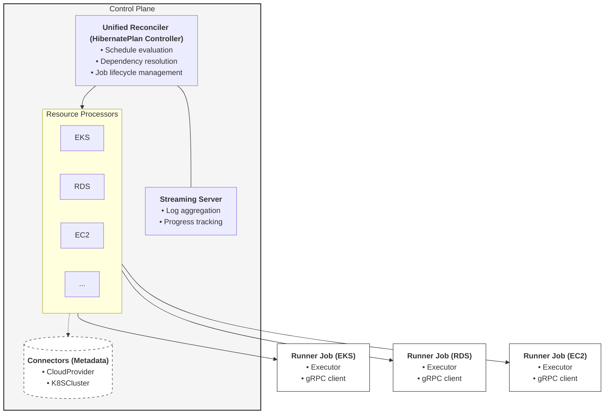

# Hibernator Operator

> Declarative Kubernetes operator for suspending and restoring cloud infrastructure during off-hours

  

## Overview

Hibernator is a Kubernetes operator that provides centralized, declarative management for suspending and restoring cloud resources during user-defined off-hours. It extends beyond Kubernetes to manage heterogeneous cloud infrastructure (EKS, RDS, EC2, and more) with dependency-aware orchestration and auditable execution.

**Key capabilities:**

- 🕐 **Timezone-aware scheduling** with start/end times and day-of-week patterns
- ⏸️ **Schedule exceptions** with lead-time grace periods (extend, suspend, replace)
- 🔗 **Dependency orchestration** using DAG, Staged, Parallel, or Sequential strategies
- 🔌 **Pluggable executor model** for AWS (EKS, RDS, EC2, Karpenter)
- 🔒 **Isolated runner jobs** with scoped RBAC, IRSA, and projected ServiceAccount tokens
- 📊 **Real-time progress streaming** via gRPC (preferred) or HTTP webhooks (fallback)
- 💾 **Durable restore metadata** persisted in ConfigMaps for safe recovery

## Why Hibernator?

**Problem:** Teams running non-production environments (DEV/STG) waste resources during off-hours. Ad-hoc scripts lack coordination, auditability, and safe restore semantics when dealing with dependencies across Kubernetes clusters, databases, and compute instances.

**Solution:** Hibernator provides intent-driven infrastructure suspension with:

- Declarative `HibernatePlan` CRDs defining *what* to suspend, not *how*
- Controller-managed dependency resolution preventing race conditions (e.g., snapshot before cluster shutdown)
- Central status ledger with execution history, logs, and restore artifact references
- GitOps-friendly configuration with validation webhooks

## Architecture

The operator adopts a **unified reconciler pattern**:

- **Control Plane**: The `HibernatePlan` controller acts as the central brain, orchestrating the lifecycle through resource-specific **processors**.
- **Connectors**: Resources like `CloudProvider` and `K8SCluster` currently serve as metadata-only containers for credentials and connectivity details.
- **Runner Jobs**: Isolated Kubernetes Jobs per target, performing the actual shutdown/wakeup operations while streaming logs back to the control plane.
- **Executors**: Pluggable implementations within the runners (EKS, RDS, EC2) handling resource-specific logic.

## Features

- **Execution Strategies**: Sequential, Parallel, DAG, and Staged orchestration.
- **Supported Executors**: EKS, RDS, EC2, Karpenter, and generic WorkloadScaler.
- **Security**: RBAC-scoped runners, IRSA support, and TokenReview authentication.
- **Schedule Exceptions**: Temporary overrides for emergency events or maintenance.

## Documentation

- 🚀 **[Usage Guide](https://ardikabs.github.io/hibernator/getting-started/)**: Installation, Quick Start, and Configuration.
- 🗺️ **[Roadmap](https://ardikabs.github.io/hibernator/roadmap/)**: Current status, planned features, and known limitations.
- 🤝 **[Contributing](CONTRIBUTING.md)**: How to get involved and development guidelines.
- 📚 **[Reference Documentation](docs/proposals/)**: Detailed design RFCs and architecture principles.