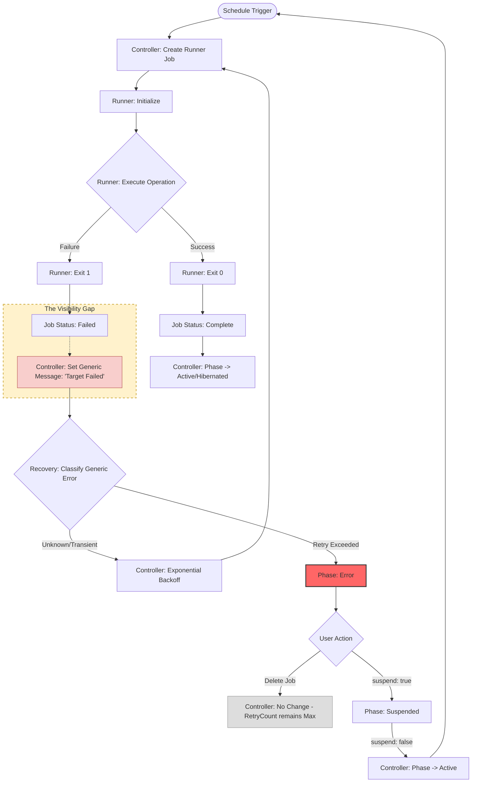
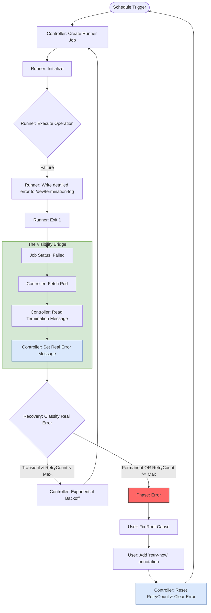

# Findings: Stateless Data Plane Error Reporting & Recovery

## Current State: Execution & Error Paths

The following diagram illustrates the **existing** flow in the project. It highlights the "Visibility Gap" where detailed error information from the data plane is lost, leading to generic recovery decisions.



### Current Path Analysis & Pain Points

1.  **Data Plane Failure:** When a Runner fails, it logs to its own stdout/stderr and exits. This information is **volatile** and not natively parsed by the Control Plane.
2.  **Generic Status:** The Controller detects `Job.Status.Failed > 0` and sets a generic error message in the `HibernatePlan.Status`.
3.  **Blind Recovery:** The `internal/recovery` package receives "one or more targets failed" instead of "AccessDenied". It cannot distinguish between a transient AWS error and a permanent configuration error, often resulting in useless retries.
4.  **The "Dead End" Problem:** If `maxRetries` is reached, the plan is stuck in `PhaseError`. Deleting the failed Job has no effect because the `status.retryCount` is never reset.
5.  **Side-Effect Recovery:** Users must use the `suspend: true -> false` workaround. This forces the phase to `Active`. If the schedule then evaluates to "should hibernate", the main loop triggers `startHibernation`.
    - **Impact:** This is a "destructive retry" because `initializeOperation` wipes the previous error context and execution ledger to start fresh.

## Proposed Solution (Comparison)

The proposed solution bridges the visibility gap and provides a native mechanism for manual recovery.



## Architectural Decision: Error Scoping & Reporting

To ensure clear separation of concerns, we define the following error handling boundaries:

1.  **Core Engine (Controller) Scope**: The Controller is responsible for handling errors related to orchestration, scheduling logic, and Kubernetes API interactions. It classifies these errors internally to decide on controller-level retries or backoffs.
2.  **Data Plane (Executor) Scope**: The Runner/Executor is responsible for errors occurring during the actual hibernation or wake-up operations (e.g., AWS API calls, database connections). These errors are strictly the mandate of the data plane.
3.  **Reporting Mechanism**: Data plane errors are not parsed by the controller's logic but are instead treated as opaque "Execution Failures" that must be reported back to the user. The reporting mechanism is strictly **stateless**:
    - The Runner emits the error to `/dev/termination-log`.
    - The Controller reads this log upon Job failure.
    - The error is surfaced in the `HibernatePlan.Status.Executions[].Message` field when the state is `Failed`.

This design ensures that the Control Plane remains decoupled from the specific failure modes of the diverse set of Executors.

### Improvements & Impact

1.  **Elimination of Volatility:** By writing to `/dev/termination-log`, the Runner ensures its failure context survives the container exit and is captured by the Kubernetes platform. Reference [Customizing the termination message](https://kubernetes.io/docs/tasks/debug/debug-application/determine-reason-pod-failure/#customizing-the-termination-message).
2.  **Informed Recovery:** The Control Plane no longer "guesses" why a target failed. It receives structured error codes, allowing it to immediately move to `PhaseError` for permanent failures (like `AccessDenied`) and save redundant retries.
3.  **Explicit Retry Signal:** The `retry-now` annotation provides a first-class citizen for manual recovery. It replaces the `suspend` toggle workaround with a clear, intent-based signal.

## Implementation Details

### Runner: Termination Log
The Runner will be updated to catch errors at the entry point and ensure they are written to the platform-native log path.

```go
// cmd/runner/main.go
if err := r.run(ctx); err != nil {
    // Platform-native error reporting
    _ = os.WriteFile(wellknown.TerminationLogPath, []byte(err.Error()), 0644)
    log.Error(err, "execution failed")
    os.Exit(1)
}
```

### Controller: Visibility Bridge
In the `reconcileExecution` loop, when a Job failure is detected, the Controller will perform a one-time Pod lookup to extract the termination message.

```go
// internal/controller/hibernateplan/controller.go
if isJobFailed {
    msg := r.getDetailedErrorFromPod(ctx, job)
    exec.Message = msg
}
```

### Controller: Manual Recovery
The `handleErrorRecovery` logic will be enhanced to check for the manual override signal before deciding to remain in `PhaseError`.

```go
// internal/controller/hibernateplan/controller.go
if !strategy.ShouldRetry {
    if plan.Annotations[wellknown.AnnotationRetryNow] == "true" {
        recovery.ResetRetryState(plan)
        // Clear annotation and requeue
    }
}
```

## Appendix: Historical Proposed Solutions

N/A - Initial investigation.

### Option A: Kubernetes Termination Messages (Selected)

The Runner will write a structured JSON error message to `/dev/termination-log` before exiting on failure. The Controller will fetch the failed Job's Pod and extract this message from `ContainerStatus.LastState.Terminated.Message`.

- **Pros**:
    - **Stateless & Network-Independent**: Uses the K8s API as the transport.
    - **Native Integration**: Standard K8s mechanism for reporting why a container exited.
    - **No Extra RBAC**: The Runner doesn't need new permissions; the Controller already has Pod read access.
    - **Structured**: Allows passing machine-readable error codes (e.g., `AWS_THROTTLING`) alongside human messages.
- **Cons**:
    - **Extra API Call**: Controller must list/get Pods for failed Jobs (mitigated by only doing this on failure).

### Option B: Runner-Driven ConfigMap Updates

The Runner could update the `restore-data-*` ConfigMap with an `error` key containing the failure details.

- **Pros**:
    - Uses existing RBAC permissions of the Runner.
- **Cons**:
    - **State Pollution**: Mixes operational error state with resource restoration state.
    - **Concurrency**: Potential for race conditions if the Controller is also trying to manage the ConfigMap.

### Option C: Kubernetes Events

The Runner could emit a Kubernetes Event associated with the Job or the HibernatePlan.

- **Pros**:
    - Visible via `kubectl get events`.
- **Cons**:
    - **Ephemeral**: Events are purged after 1 hour by default.
    - **Difficulty in Retrieval**: Harder for the Controller to reliably "lookup" and associate with a specific execution ID compared to a direct Pod reference.

## Implementation Details (Proposed)

### Runner Changes
Update `cmd/runner/main.go` to catch errors and write to the termination log.

```go
if err := r.run(ctx); err != nil {
    // Write to /dev/termination-log
    os.WriteFile(wellknown.TerminationLogPath, []byte(err.Error()), 0644)
    log.Error(err, "execution failed")
    os.Exit(1)
}
```

### Controller Changes
Update `reconcileExecution` to find the Pod of a failed Job and extract the message.

```go
if isJobFailed {
    // 1. List pods for job
    // 2. Extract pod.Status.ContainerStatuses[0].LastState.Terminated.Message
    // 3. Update execution.Message with this detailed error
}
```

## Impact

- **Accurate Recovery**: The `internal/recovery` package can now use real error messages to distinguish between `Transient` and `Permanent` failures.
- **Better UX**: `kubectl describe hibernateplan` will show the actual root cause (e.g., `AccessDenied`) instead of "Job failed."
- **Stateless Reliability**: Error reporting works even if the Runner's network is completely isolated.

## Manual Intervention & Recovery Strategy

When a plan transitions to `PhaseError` because max retries are exceeded, it currently requires a clunky `suspend -> unsuspend` dance to trigger a retry.

### Proposed: The "Retry Annotation" Signal
Introduce a well-known annotation: `hibernator.ardikabs.com/retry-now: "true"`.
- When the Reconciler detects this annotation on a plan in `PhaseError`:
    1. It calls `recovery.ResetRetryState(plan)`.
    2. It removes the annotation.
    3. It transitions the phase back to `Hibernating` or `WakingUp` (based on schedule evaluation).

## Appendix: Historical Proposed Solutions

N/A - Initial investigation.
