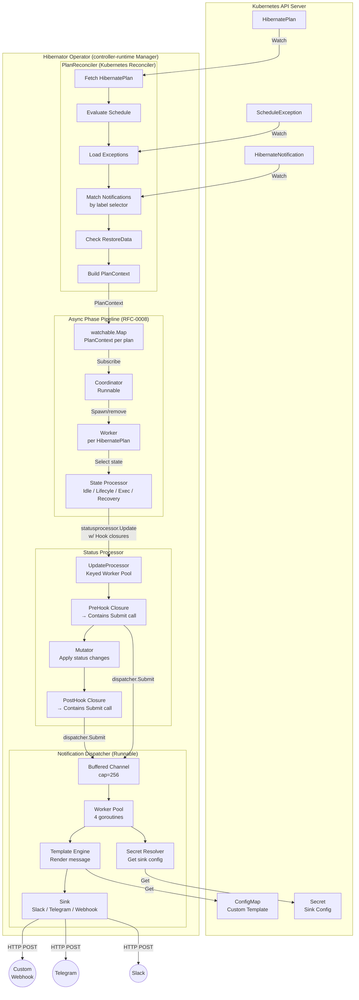
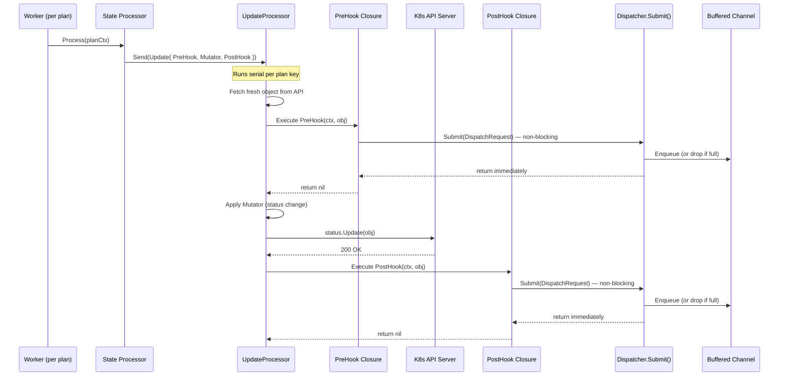
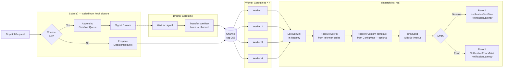
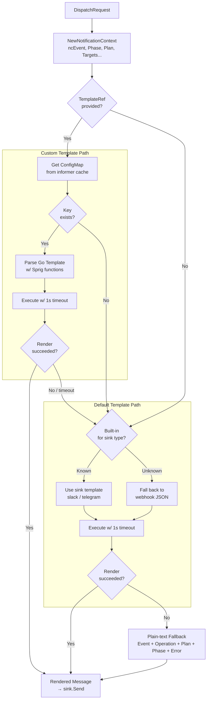
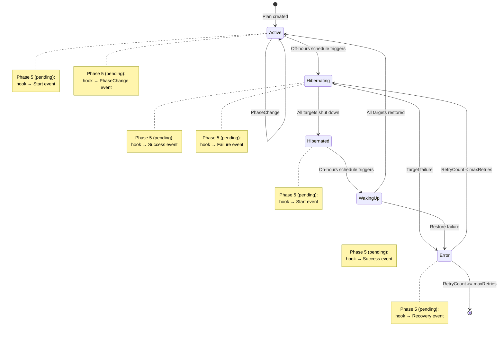
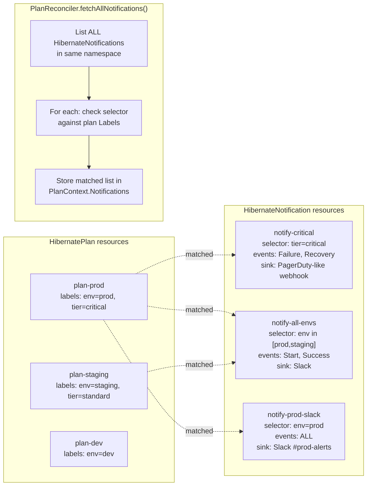
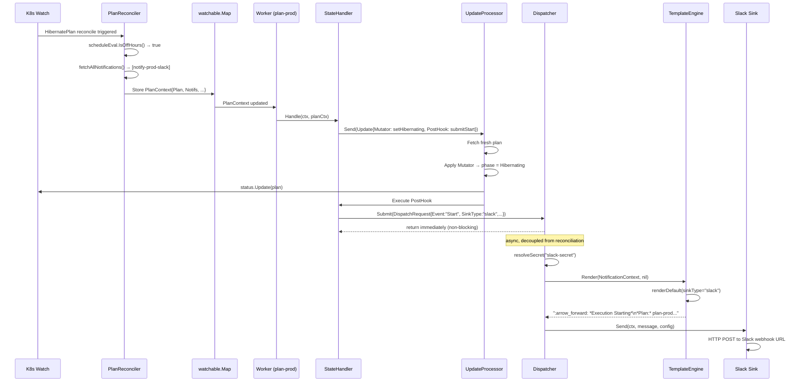

# Notification System Flow

This document visualizes how the RFC-0006 Notification System integrates with the existing Hibernator Operator control plane.

---

## 1. Big Picture — Where Notifications Fit

---

## 2. Hook Execution — Status Update Lifecycle

Each state handler sends a `statusprocessor.Update` with optional `PreHook` and `PostHook` closures. The processor executes them in order around the API server write.

> **Key property**: `Submit()` is completely non-blocking. Hook closures return immediately regardless of channel state. Notifications never block or fail reconciliation.

---

## 3. Dispatcher Internals — From Channel to Sink

---

## 4. Template Rendering Pipeline

**Built-in default templates**:

| Sink Type | Format | Event Indicators |
|-----------|--------|-----------------|
| `slack` | Markdown | `:red_circle:` Failure · `:white_check_mark:` Success · `:arrow_forward:` Start · `:recycle:` Recovery |
| `telegram` | HTML (`<b>`, `<i>`) | 🔴 🟢 ▶️ ♻️ ℹ️ Unicode emoji |
| `webhook` | Raw JSON | Machine-readable flat envelope |

---

## 5. Event Trigger Points in the State Machine

> **Note**: Hook wiring into state handlers (Phase 5) is the next implementation step. The dispatcher, template engine, and CRD are already live.

---

## 6. Notification Resource Matching

A `HibernateNotification` attaches to plans via label selectors, parallel to how exceptions work.

---

## 7. End-to-End Message Journey

---

## Component Registry (Quick Reference)

| Component | Location | Role |
|-----------|----------|------|
| `HibernateNotification` CRD | `api/v1alpha1/hibernatenotification_types.go` | User-facing intent: which events → which sinks |
| `PlanContext.Notifications` | `internal/message/types.go` | Carries matched notifications into worker pipeline |
| `fetchAllNotifications()` | `internal/provider/provider.go` | Matches notifications to plan at reconcile time |
| `statusprocessor.Update` | `internal/provider/processor/status/processor.go` | Carries Pre/PostHook closures around status writes |
| `notification.Dispatcher` | `internal/notification/dispatcher.go` | Async worker pool runnable |
| `notification.TemplateEngine` | `internal/notification/template.go` | Go template rendering with Sprig, built-in defaults |
| `notification.Registry` | `internal/notification/sink.go` | Sink implementation lookup by type |
| `sink/slack` | `internal/notification/sink/slack/slack.go` | Slack Incoming Webhook delivery |
| `sink/telegram` | `internal/notification/sink/telegram/telegram.go` | Telegram Bot API delivery |
| `setup.go` wiring | `internal/provider/setup.go` | Creates TemplateEngine + Dispatcher, registers as Runnable |

---

## Known Architectural Findings

> Full analysis in [notification-review.md](notification-review.md).

### Security: Template Trust Boundary

The template engine sits at a **trust boundary**: template strings come from ConfigMaps that
namespace-scoped users can create, but they execute in the operator pod's process. Sprig v3's
`TxtFuncMap()` includes `env` and `expandenv`, which can read all operator pod environment
variables. Custom templates should be treated as **untrusted input**.

**Required hardening**:
- Restricted Sprig function map (remove `env`, `expandenv`)
- Template string length limit
- Output length limit (prevent memory amplification via Sprig `repeat`)

### Delivery Guarantees

The system provides **at-most-once delivery**:

- Notifications can be lost during operator shutdown (workers use a cancelled parent context)
- Sink delivery failures are logged and metered but not retried at the application level
- At sustained overflow, items may be dropped (once overflow cap is added)

This is acceptable for a notification (not alerting) system but should be documented for users.

### Overflow Queue Backpressure

The overflow queue is currently unbounded. Under sustained pressure from a slow downstream
sink, it will grow without limit and potentially cause OOM. A configurable cap with
drop-on-full and `NotificationDropTotal` metrics is required before production use.

### Graceful Shutdown Context Propagation

During shutdown, the manager context is cancelled before workers finish draining the channel.
Workers calling `dispatch(ctx, req)` with the cancelled context create a child timeout context
that is immediately cancelled, causing all remaining dispatches to fail. A detached context
with a bounded shutdown timeout is needed for the drain phase.
