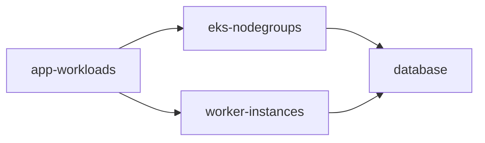
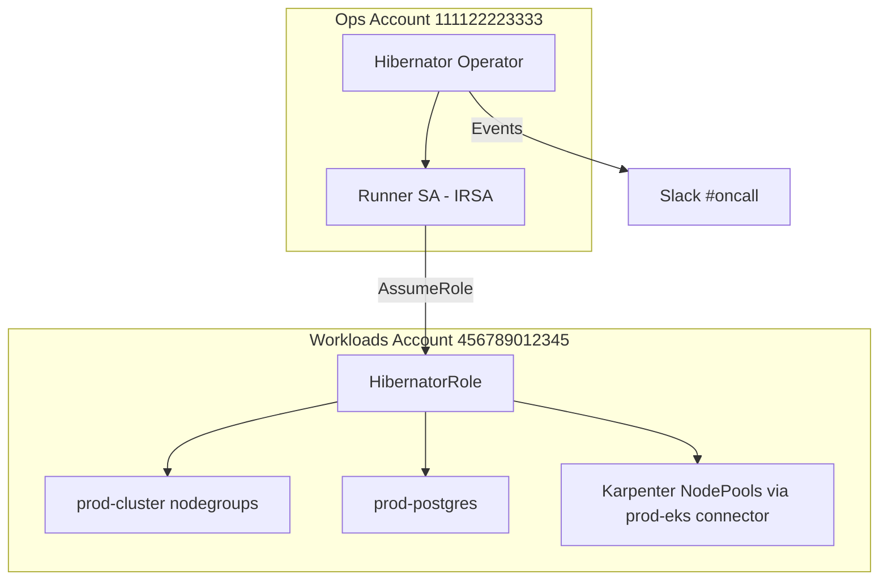

# Website "Scenarios" Section Implementation Plan

> **For agentic workers:** REQUIRED SUB-SKILL: Use superpowers:subagent-driven-development (recommended) or superpowers:executing-plans to implement this plan task-by-task. Steps use checkbox (`- [ ]`) syntax for tracking.

**Goal:** Add a "Scenarios" section to the Hibernator documentation website — a progressive ladder (Basic → Intermediate → Advanced → Expert) of 10 complete, business-framed, copy-pasteable hibernation setups plus an index page.

**Architecture:** New `website/docs/scenarios/` directory with 11 markdown pages, registered in `website/mkdocs.yml` nav between "User Guides" and "Reference". Content is grounded exclusively in verified sources: `website/docs/reference/executor-parameters.md`, `api/v1alpha1/*_types.go`, and existing website guides. No code changes, no new CRDs, no new sample files.

**Tech Stack:** MkDocs Material (admonitions, tabs, mermaid, tables), Docker-based `make docs-build` for verification.

**Spec:** `docs/superpowers/specs/2026-07-23-website-user-scenarios-design.md`

---

## Global Rules (apply to every task)

1. **Style:** Follow `website/docs/getting-started/quickstart.md` conventions — `# Title` H1, numbered sections, ```yaml blocks, ```bash verification blocks, `!!! note` / `!!! warning` / `!!! tip` admonitions, tables for structured data, "Next Steps" closing section with links.
2. **YAML accuracy:** Executor `parameters:` blocks MUST match `website/docs/reference/executor-parameters.md` exactly. Critical details:
   - RDS dynamic tag selection REQUIRES `discoverInstances: true` and/or `discoverClusters: true` (tags alone = no-op). Explicit `instanceIds`/`clusterIds` need no discover flags.
   - Karpenter: `nodePools: []` = all pools; `nodeSelector` (metav1.LabelSelector) for label-based; mutually exclusive.
   - EKS: `clusterName` required; `nodeGroups: []` = all; `nodeGroups: [{name: x}]` for specific.
   - WorkloadScaler: `namespace.literals` or `namespace.selector` (exactly one); `includedGroups` defaults to `[Deployment]`; `workloadSelector` optional metav1.LabelSelector.
   - NoOp: `randomDelaySeconds` (max 30, default 1), `failureMode` (`none`|`shutdown`|`wakeup`|`both`), `failureMessage`.
   - All executors: `awaitCompletion: {enabled: true, timeout: "5m"}` optional; defaults EC2/Karpenter/WorkloadScaler 5m, EKS 10m, RDS 15m.
3. **Never use deprecated fields:** no `failFast` (deprecated, redundant with `mode`), no RDS `excludeTags`, no `nodePools` when label selection is the point (use `nodeSelector`).
4. **`daysOfWeek` short form:** `["MON", "TUE", "WED", "THU", "FRI", "SAT", "SUN"]` (API enum).
5. **Wakeup is always reverse of shutdown** for every strategy — state this where relevant.
6. **CRs live in `namespace: hibernator-system`** (site convention).
7. **Link, don't re-explain:** for concepts use relative links — `../concepts/hibernateplan.md`, `../concepts/executors.md`, `../concepts/schedule-exceptions.md`, `../concepts/connectors.md`, `../user-guides/execution-strategies.md`, `../user-guides/schedule-exceptions.md`, `../user-guides/composing-multiple-exceptions.md`, `../user-guides/hibernation-lifecycle.md`, `../user-guides/multi-window-schedules.md`, `../user-guides/schedule-boundaries.md`, `../user-guides/plan-suspension.md`, `../user-guides/override-actions.md`, `../user-guides/error-recovery.md`, `../user-guides/notifications.md`, `../user-guides/ec2-executor.md`, `../user-guides/eks-executor.md`, `../user-guides/rds-executor.md`, `../user-guides/karpenter-executor.md`, `../user-guides/workloadscaler-executor.md`, `../user-guides/noop-executor.md`, `../user-guides/cli.md`, `../user-guides/troubleshooting.md`, `../reference/executor-parameters.md`, `../reference/notification-sinks.md`, `../reference/metrics.md`, `../getting-started/quickstart.md`.
8. **Page anatomy** (every scenario page): H1 → intro business context (1–2 paragraphs, named persona + company-ish framing) → "Goal" → "Resources Involved" (table or mermaid) → YAML section(s) → "How It Executes" walkthrough → "Verification" → "Variations" (1–3 bullets with small YAML diffs where useful) → "Next Steps".
9. **No git commits** — project rule: commits only on explicit user request.
10. **Verification command** (only Task 13): `make docs-build` — expect `Documentation built: website/site/` with no warnings about scenarios files.

---

## World-Building Consistency (shared naming across pages)

| Page | Company framing | Cloud account | Region | Timezone |
|---|---|---|---|---|
| B1 nightly-full-shutdown | Startup dev env | `123456789012` (aws-dev) | ap-southeast-3 | Asia/Jakarta |
| B2 weekend-hibernation | Agency dev env | `123456789012` (aws-dev) | ap-southeast-3 | Asia/Jakarta |
| I1 partial-hibernation | SaaS shared staging | `210987654321` (aws-staging) | us-west-2 | America/Los_Angeles |
| I2 partial-failure-besteffort | Retail fleet, 40+ namespaces | `210987654321` (aws-staging) | us-east-1 | America/New_York |
| A1 dependency-ordered | E-commerce prod-like | `456789012345` (aws-production) | ap-southeast-3 | Asia/Jakarta |
| A2 staged-criticality | Enterprise shared test cluster | `456789012345` (aws-production) | us-west-2 | America/New_York |
| A3 event-mode-overrides | E-commerce Black Friday | `456789012345` (aws-production) | ap-southeast-3 | Asia/Jakarta |
| A4 holiday-replacement | Company year-end shutdown | `456789012345` (aws-production) | us-west-2 | America/New_York |
| E1 dry-run-rehearsal | Platform team pre-rollout | n/a (noop) | n/a | Asia/Jakarta |
| E2 production-grade | Platform team, 2 AWS accounts | ops `111122223333`, workloads `456789012345` | ap-southeast-3 | Asia/Jakarta |

---

### Task 1: Scenarios index page

**Files:**
- Create: `website/docs/scenarios/index.md`

- [ ] **Step 1: Write the page**

Content requirements:
- H1 `# Scenarios`; intro: real-world setups ordered from simplest to most advanced; each page is self-contained with complete YAML; assumes operator installed (link `../getting-started/installation.md`) and basic plan knowledge (link `../getting-started/quickstart.md`).
- "The Scenario Ladder" table: columns `Tier | Scenario | What it demonstrates | Link` with all 10 scenarios:
  - Basic: Nightly Full Shutdown & Wakeup (`nightly-full-shutdown.md`) — one plan stops a whole environment; Weekend Hibernation (`weekend-hibernation.md`) — Friday night → Monday morning.
  - Intermediate: Partial Hibernation (`partial-hibernation-critical-services.md`) — keep critical services running; Tolerating Partial Failures (`partial-failure-besteffort.md`) — BestEffort fleets.
  - Advanced: Dependency-Ordered Shutdown (`dependency-ordered-shutdown.md`) — DAG, DB last down / first up; Staged by Criticality (`staged-hibernation-criticality.md`); Event-Mode Overrides (`event-mode-overrides.md`) — extend + targetOverrides; Holiday Schedule Replacement (`holiday-schedule-replacement.md`) — replace + executionOverride.
  - Expert: Dry-Run Rehearsal (`dry-run-rehearsal.md`) — noop; Production-Grade Setup (`production-grade-setup.md`) — cross-account + notifications.
- "Capability Matrix" table: rows = 10 scenarios, columns = `Strategy | Behavior | Exception | Executors | Key feature`:
  - B1: Parallel | Strict | — | eks, rds, ec2 | Full lifecycle
  - B2: Parallel | Strict | — | eks, rds | Schedule windows
  - I1: Parallel | Strict | — | workloadscaler, karpenter, eks | Selector granularity
  - I2: Parallel | BestEffort | — | workloadscaler, ec2 | Failure tolerance
  - A1: DAG | Strict | — | workloadscaler, eks, rds | Ordering
  - A2: Staged | Strict | — | workloadscaler, karpenter, eks, rds | Stage groups
  - A3: Parallel (base) | Strict | extend + targetOverrides | ec2, eks, rds | Per-target overrides
  - A4: Sequential (override) | BestEffort (override) | replace + executionOverride | eks, rds | Schedule + strategy replacement
  - E1: DAG | BestEffort | — | noop | Failure simulation
  - E2: DAG | Strict | replace (referenced) | eks, karpenter, rds | Cross-account + notifications
- "How to Use These Scenarios" section: copy-paste adaptable; names/accounts/regions are illustrative; every YAML block is complete (connectors shown or referenced); adjust selectors to your tags/labels.
- Note box: GCP executors (`gke`, `cloudsql`) are not covered — link `../roadmap.md`.

- [ ] **Step 2: Confirm file exists**

Run: `ls website/docs/scenarios/index.md`
Expected: file listed.

---

### Task 2: B1 — Nightly Full Shutdown & Wakeup

**Files:**
- Create: `website/docs/scenarios/nightly-full-shutdown.md`

- [ ] **Step 1: Write the page**

Framing: platform engineer at a startup; one dev EKS environment; everything (node groups, database, bastion) should stop weeknights 20:00→06:00 Asia/Jakarta and come back in the morning. The canonical "full shutdown / full wakeup".

Resources table: `dev-nodegroups` (eks, all node groups in `dev-cluster`), `dev-database` (rds, explicit `dev-postgres`), `dev-bastion` (ec2, tag `Environment=dev, Role=bastion`).

Complete YAML (show all three resources in one fenced block, in this order):

```yaml
apiVersion: hibernator.ardikabs.com/v1alpha1
kind: CloudProvider
metadata:
  name: aws-dev
  namespace: hibernator-system
spec:
  type: aws
  aws:
    accountId: "123456789012"
    region: ap-southeast-3
    assumeRoleArn: arn:aws:iam::123456789012:role/hibernator-runner
    auth:
      serviceAccount: {}
---
apiVersion: hibernator.ardikabs.com/v1alpha1
kind: HibernatePlan
metadata:
  name: dev-nightly
  namespace: hibernator-system
spec:
  schedule:
    timezone: "Asia/Jakarta"
    offHours:
      - start: "20:00"
        end: "06:00"
        daysOfWeek: ["MON", "TUE", "WED", "THU", "FRI"]
  execution:
    strategy:
      type: Parallel
      maxConcurrency: 3
  behavior:
    mode: Strict
    retries: 2
  targets:
    - name: dev-nodegroups
      type: eks
      connectorRef:
        kind: CloudProvider
        name: aws-dev
      parameters:
        clusterName: dev-cluster
        nodeGroups: []
        awaitCompletion:
          enabled: true
    - name: dev-database
      type: rds
      connectorRef:
        kind: CloudProvider
        name: aws-dev
      parameters:
        selector:
          instanceIds: [dev-postgres]
        snapshotBeforeStop: true
        awaitCompletion:
          enabled: true
    - name: dev-bastion
      type: ec2
      connectorRef:
        kind: CloudProvider
        name: aws-dev
      parameters:
        selector:
          tags:
            Environment: dev
            Role: bastion
        awaitCompletion:
          enabled: true
```

"How It Executes": 20:00 → phase `Hibernating`, all 3 targets in parallel (bounded 3), restore data saved to ConfigMaps; → `Hibernated`; 06:00 → `WakingUp` (same strategy, wakeup restores from saved state); → `Active`. Phase table (`Active/Hibernating/Hibernated/WakingUp/Suspended/Error`) like quickstart's. Explain Parallel choice (independent targets, fastest) + link `../user-guides/execution-strategies.md`. Note that `snapshotBeforeStop: true` guards the DB.

Verification:
```bash
kubectl get hibernateplan dev-nightly -n hibernator-system -w
kubectl get hibernateplan dev-nightly -n hibernator-system -o jsonpath='{.status.executions}' | jq
kubectl logs -n hibernator-system -l hibernator.ardikabs.com/plan=dev-nightly
```

Variations: (1) fewer parallel targets → `maxConcurrency: 1` equals ordered-ish; (2) add weekends → see `weekend-hibernation.md`; (3) replace explicit DB id with tag discovery — show `selector: {tags: {Environment: dev}, discoverInstances: true}` and warn tags alone are a no-op without `discoverInstances`.

Next Steps: `../user-guides/hibernation-lifecycle.md`, `../user-guides/monitor` → use `../user-guides/cli.md`, `weekend-hibernation.md`.

- [ ] **Step 2: Confirm file exists**

Run: `ls website/docs/scenarios/nightly-full-shutdown.md`

---

### Task 3: B2 — Weekend Hibernation

**Files:**
- Create: `website/docs/scenarios/weekend-hibernation.md`

- [ ] **Step 1: Write the page**

Framing: dev env only used Mon–Fri business hours; goal: off Friday 20:00 → Monday 06:00 (and effectively all weekend) without touching anything.

Core teaching (this page is schedule-focused, targets minimal — one eks + one rds, same connectors framing as B1 but inline single CloudProvider again for self-containment, account `123456789012`):
- Key fact 1: wakeup only triggers on days listed in `daysOfWeek`. A `MON–FRI 20:00→06:00` window already keeps resources hibernated all weekend (Friday night's cycle wakes Monday 06:00).
- Key fact 2: `end < start` means the window crosses midnight into the next day.
- Present **Option A** (recommended, nothing to do): standard weekday window YAML (like B1 schedule) + explanation of Friday→Monday behavior.
- Present **Option B** (explicit weekend window for different weekend hours, e.g. wake Saturday 10:00 for a few hours): multi-window schedule:

```yaml
  schedule:
    timezone: "Asia/Jakarta"
    offHours:
      - start: "20:00"
        end: "06:00"
        daysOfWeek: ["MON", "TUE", "WED", "THU", "FRI"]
      - start: "06:00"
        end: "10:00"
        daysOfWeek: ["SAT"]
```

Explain: Saturday window hibernates 06:00→10:00 then wakes 10:00 (so the env is usable Saturday morning 10:00→20:00... wait — after Saturday 10:00 wakeup, next window is Monday 20:00; env stays UP Sat 10:00 → Mon 20:00? No — Sunday has no window and Monday's window starts 20:00, so env is up from Sat 10:00 until Mon 20:00. State this precisely and note whether that matches intent; recommend Option A when "off all weekend" is the goal.)

Full plan YAML for Option A:

```yaml
apiVersion: hibernator.ardikabs.com/v1alpha1
kind: HibernatePlan
metadata:
  name: dev-weekender
  namespace: hibernator-system
spec:
  schedule:
    timezone: "Asia/Jakarta"
    offHours:
      - start: "20:00"
        end: "06:00"
        daysOfWeek: ["MON", "TUE", "WED", "THU", "FRI"]
  execution:
    strategy:
      type: Parallel
  behavior:
    mode: Strict
    retries: 2
  targets:
    - name: dev-nodegroups
      type: eks
      connectorRef:
        kind: CloudProvider
        name: aws-dev
      parameters:
        clusterName: dev-cluster
        nodeGroups: []
        awaitCompletion:
          enabled: true
    - name: dev-database
      type: rds
      connectorRef:
        kind: CloudProvider
        name: aws-dev
      parameters:
        selector:
          instanceIds: [dev-postgres]
        snapshotBeforeStop: true
        awaitCompletion:
          enabled: true
```

Timeline table: Fri 20:00 shutdown → Sat/Sun `Hibernated` → Mon 06:00 wakeup. Warning: holidays are NOT weekends — link `../user-guides/schedule-exceptions.md` (extend for weekday holiday). Links: `../user-guides/multi-window-schedules.md`, `../user-guides/schedule-boundaries.md`.

- [ ] **Step 2: Confirm file exists**

Run: `ls website/docs/scenarios/weekend-hibernation.md`

---

### Task 4: I1 — Partial Hibernation (Keep Critical Services Running)

**Files:**
- Create: `website/docs/scenarios/partial-hibernation-critical-services.md`

- [ ] **Step 1: Write the page**

Framing: SaaS company shared staging cluster; teams need `core-services` (auth, config) up 24/7 even at night, but everything else (feature namespaces, batch node pools, extra node groups) should stop to save cost. "Partial hibernation = different treatment per service, expressed through selection granularity."

Resources table: `non-critical-workloads` (workloadscaler, namespaces by label, excludes critical), `batch-nodepools` (karpenter, `nodeSelector` on `workload=batch`), `staging-nodegroups` (eks, only named `spot-workers` group). Explicitly NOT in plan: `core-services` namespace, `system` node group, shared RDS (stays up for schema access — mention as design decision).

Connectors YAML (both kinds, self-contained): CloudProvider `aws-staging` account `210987654321` region us-west-2 + K8SCluster `staging-eks` (providerRef aws-staging, eks name `staging-cluster`, region us-west-2).

Plan YAML:

```yaml
apiVersion: hibernator.ardikabs.com/v1alpha1
kind: HibernatePlan
metadata:
  name: staging-partial
  namespace: hibernator-system
spec:
  schedule:
    timezone: "America/Los_Angeles"
    offHours:
      - start: "19:00"
        end: "07:00"
        daysOfWeek: ["MON", "TUE", "WED", "THU", "FRI"]
  execution:
    strategy:
      type: Parallel
      maxConcurrency: 3
  behavior:
    mode: Strict
    retries: 2
  targets:
    - name: non-critical-workloads
      type: workloadscaler
      connectorRef:
        kind: K8SCluster
        name: staging-eks
      parameters:
        namespace:
          selector:
            environment: staging
        workloadSelector:
          matchExpressions:
            - key: critical
              operator: DoesNotExist
        includedGroups: [Deployment, StatefulSet]
        awaitCompletion:
          enabled: true
    - name: batch-nodepools
      type: karpenter
      connectorRef:
        kind: K8SCluster
        name: staging-eks
      parameters:
        nodeSelector:
          matchLabels:
            workload: batch
        awaitCompletion:
          enabled: true
          timeout: "10m"
    - name: staging-nodegroups
      type: eks
      connectorRef:
        kind: CloudProvider
        name: aws-staging
      parameters:
        clusterName: staging-cluster
        nodeGroups:
          - name: spot-workers
        awaitCompletion:
          enabled: true
          timeout: "10m"
```

"How It Executes": what gets stopped (matching workloads → 0 replicas with original counts saved to restore data; batch NodePools deleted & rebuilt on wakeup — link `../user-guides/karpenter-executor.md` for drain semantics; `spot-workers` group → 0) vs what keeps running (unmatched namespaces/workloads, other NodePools/groups, anything not in the plan). Key insight box: partial hibernation is expressed by **what you select**, not by a "partial" flag — anything not matched by a target keeps running; anything not in the plan is untouched. Note workloadscaler restores original replica counts on wakeup (link `../user-guides/workloadscaler-executor.md`).

Variations: (1) label-based opt-in model instead (`matchLabels: {hibernation: enabled}` — teams annotate to opt in); (2) exclude critical namespaces explicitly with `namespace.literals` list of only hibernatable namespaces; (3) protect a critical NodePool (link karpenter guide pattern).

- [ ] **Step 2: Confirm file exists**

Run: `ls website/docs/scenarios/partial-hibernation-critical-services.md`

---

### Task 5: I2 — Tolerating Partial Failures (BestEffort)

**Files:**
- Create: `website/docs/scenarios/partial-failure-besteffort.md`

- [ ] **Step 1: Write the page**

Framing: retail company, one big test cluster, 6 namespace groups hibernated nightly; some namespaces always have a stuck PDB or finalizer; with `Strict` one bad namespace blocked the other five; switch to `BestEffort` so the fleet still hibernates and failures are reviewed in the morning.

Teaching table — Strict vs BestEffort (from `api/v1alpha1/hibernateplan_types.go`): Strict halts on first failure, no further targets start, plan → `Error`; BestEffort continues remaining targets, failed targets recorded, plan does not enter Error for target failures. Retries still apply per target before marking Failed. (Also note DAG+BestEffort `Aborted` semantics exist — one line, link A1 page.)

Plan YAML (us-east-1, America/New_York, account `210987654321`, connectors: one K8SCluster `fleet-eks` with providerRef aws-staging; show K8SCluster + plan, CloudProvider reference-only):

```yaml
apiVersion: hibernator.ardikabs.com/v1alpha1
kind: HibernatePlan
metadata:
  name: fleet-nightly
  namespace: hibernator-system
spec:
  schedule:
    timezone: "America/New_York"
    offHours:
      - start: "21:00"
        end: "06:00"
        daysOfWeek: ["MON", "TUE", "WED", "THU", "FRI"]
  execution:
    strategy:
      type: Parallel
      maxConcurrency: 5
  behavior:
    mode: BestEffort
    retries: 3
  targets:
    - name: ns-shop
      type: workloadscaler
      connectorRef: {kind: K8SCluster, name: fleet-eks}
      parameters:
        namespace: {literals: [shop-web, shop-api]}
        awaitCompletion: {enabled: true}
    - name: ns-inventory
      type: workloadscaler
      connectorRef: {kind: K8SCluster, name: fleet-eks}
      parameters:
        namespace: {literals: [inventory]}
        awaitCompletion: {enabled: true}
    - name: ns-pricing
      type: workloadscaler
      connectorRef: {kind: K8SCluster, name: fleet-eks}
      parameters:
        namespace: {literals: [pricing]}
        awaitCompletion: {enabled: true}
    - name: ns-reports
      type: workloadscaler
      connectorRef: {kind: K8SCluster, name: fleet-eks}
      parameters:
        namespace: {literals: [reports]}
        includedGroups: [Deployment, StatefulSet]
        awaitCompletion: {enabled: true}
    - name: batch-instances
      type: ec2
      connectorRef: {kind: CloudProvider, name: aws-staging}
      parameters:
        selector:
          tags: {Environment: test, Role: batch}
        awaitCompletion: {enabled: true}
```

(Use expanded YAML style in the page, not flow-style `{}` — expand all connectorRef/parameters to standard indented form.)

"How It Executes": 21:00 all five start (bounded 5); `ns-pricing` hits a stuck workload, retries 3×, marked `Failed`; others `Completed`; plan reaches `Hibernated` (with failures recorded), wakeup proceeds for completed targets; morning review via ledger.

Verification:
```bash
kubectl get hibernateplan fleet-nightly -n hibernator-system \
  -o jsonpath='{range .status.executions[*]}{.target}{"\t"}{.state}{"\t"}{.message}{"\n"}{end}'
kubectl get hibernateplan fleet-nightly -n hibernator-system -o jsonpath='{.status.phase}'
```
Expected sample output table showing 4 Completed + 1 Failed. Then: fix root cause, link `../user-guides/error-recovery.md` and `../user-guides/override-actions.md` (retry-now). Warning: BestEffort is not "ignore failures" — ledger + notifications (link I2→`../user-guides/notifications.md`) are how you stay honest.

- [ ] **Step 2: Confirm file exists**

Run: `ls website/docs/scenarios/partial-failure-besteffort.md`

---

### Task 6: A1 — Dependency-Ordered Shutdown (DAG)

**Files:**
- Create: `website/docs/scenarios/dependency-ordered-shutdown.md`

- [ ] **Step 1: Write the page**

Framing: e-commerce production-like environment. Requirements: (1) app pods must be scaled down before node groups shrink (clean drain, no connection churn); (2) database stops LAST, after all DB clients are gone (clean final snapshot); (3) morning: DB starts FIRST, apps last. "Order matters → DAG."

Mermaid diagram (shutdown direction):



Plan YAML (ap-southeast-3, Asia/Jakarta, account `456789012345` aws-production + K8SCluster `prod-eks`; show both connectors + plan):

```yaml
apiVersion: hibernator.ardikabs.com/v1alpha1
kind: HibernatePlan
metadata:
  name: prod-ordered
  namespace: hibernator-system
spec:
  schedule:
    timezone: "Asia/Jakarta"
    offHours:
      - start: "23:00"
        end: "05:00"
        daysOfWeek: ["MON", "TUE", "WED", "THU", "FRI", "SAT", "SUN"]
  execution:
    strategy:
      type: DAG
      maxConcurrency: 2
      dependencies:
        - from: app-workloads
          to: eks-nodegroups
        - from: app-workloads
          to: worker-instances
        - from: eks-nodegroups
          to: database
        - from: worker-instances
          to: database
  behavior:
    mode: Strict
    retries: 3
  targets:
    - name: app-workloads
      type: workloadscaler
      connectorRef: {kind: K8SCluster, name: prod-eks}
      parameters:
        namespace: {literals: [shopfront, checkout]}
        includedGroups: [Deployment]
        awaitCompletion: {enabled: true}
    - name: eks-nodegroups
      type: eks
      connectorRef: {kind: CloudProvider, name: aws-production}
      parameters:
        clusterName: prod-cluster
        nodeGroups: []
        awaitCompletion: {enabled: true, timeout: "10m"}
    - name: worker-instances
      type: ec2
      connectorRef: {kind: CloudProvider, name: aws-production}
      parameters:
        selector:
          tags: {Component: worker}
        awaitCompletion: {enabled: true}
    - name: database
      type: rds
      connectorRef: {kind: CloudProvider, name: aws-production}
      parameters:
        selector:
          instanceIds: [prod-postgres]
        snapshotBeforeStop: true
        awaitCompletion: {enabled: true, timeout: "15m"}
```

(Expand flow-style to indented YAML in the page.)

"How It Executes": shutdown levels — L0 `app-workloads` (no upstream) → L1 `eks-nodegroups` + `worker-instances` (parallel, bounded by maxConcurrency 2) → L2 `database` last; wakeup reversed — `database` → `eks-nodegroups` + `worker-instances` → `app-workloads`. Semantics box: `from: A, to: B` = A completes before B starts (shutdown); wakeup always reverses. Why DB last/first: snapshot after connections drained; apps need DB up. Cycle detection note (webhook rejects cycles at admission, link `../user-guides/execution-strategies.md#cycle-detection`). One-liner: with `BestEffort`, failed upstream → downstream `Aborted` (link `partial-failure-besteffort.md`).

Verification: watch ledger order via StartedAt:
```bash
kubectl get hibernateplan prod-ordered -n hibernator-system \
  -o jsonpath='{range .status.executions[*]}{.target}{"\t"}{.state}{"\t"}{.startedAt}{"\n"}{end}'
```

Variations: (1) Karpenter pools before managed node groups (link `../user-guides/karpenter-executor.md` combined pattern); (2) four-tier version → consider Staged instead (link `staged-hibernation-criticality.md`); (3) same DAG with Sequential equivalence note (Sequential = linear chain only).

- [ ] **Step 2: Confirm file exists**

Run: `ls website/docs/scenarios/dependency-ordered-shutdown.md`

---

### Task 7: A2 — Staged Hibernation by Criticality

**Files:**
- Create: `website/docs/scenarios/staged-hibernation-criticality.md`

- [ ] **Step 1: Write the page**

Framing: enterprise shared test cluster; cost-optimal but polite: hibernate in criticality order — dev namespaces first (instant), then batch pools (need drain time), then shared infra (node groups + reporting DB) last. Wakeup restores in reverse criticality.

Teaching: Staged strategy — stages run in declaration order; next stage starts only after ALL targets in previous stage complete; `parallel: true` within a stage (bounded by stage `maxConcurrency`); wakeup runs stages in reverse order; observe progress via `status.currentStageIndex`. DAG vs Staged guidance: DAG = fine-grained dependency graph; Staged = coarse tiers with group parallelism (link `../user-guides/execution-strategies.md`).

Plan YAML (us-west-2, America/New_York, account `456789012345`; connectors reference-only, plan in full):

```yaml
  execution:
    strategy:
      type: Staged
      stages:
        - name: dev-workloads
          parallel: true
          maxConcurrency: 3
          targets: [dev-ns-a, dev-ns-b, dev-ns-c]
        - name: batch-compute
          parallel: false
          targets: [batch-nodepools]
        - name: shared-infra
          parallel: false
          targets: [shared-nodegroups, reporting-db]
```

Targets: `dev-ns-a/b/c` = workloadscaler (namespaces `team-a`, `team-b`, `team-c` via literals, awaitCompletion enabled); `batch-nodepools` = karpenter `nodeSelector matchLabels {workload: batch}` timeout 10m; `shared-nodegroups` = eks clusterName `test-cluster`, nodeGroups `[{name: shared-1}, {name: shared-2}]`, timeout 10m; `reporting-db` = rds instanceIds `[reporting-db]`, snapshotBeforeStop true, timeout 15m.

Schedule: 20:00→06:00 MON–FRI America/New_York. behavior Strict retries 2.

Shutdown stage table (Stage | Targets | Mode | Why this order) + wakeup reverse note. Verification: `kubectl get hibernateplan test-staged -n hibernator-system -o jsonpath='{.status.currentStageIndex}{"\n"}{.status.currentOperation}'` plus ledger query. Plan name: `test-staged`.

Variations: (1) mixed parallelism per stage (dev sequential, batch parallel); (2) stage boundaries as change windows (pause between stages → use separate plans or suspend, link `../user-guides/plan-suspension.md`); (3) many namespaces → namespace.selector instead of literals.

- [ ] **Step 2: Confirm file exists**

Run: `ls website/docs/scenarios/staged-hibernation-criticality.md`

---

### Task 8: A3 — Event-Mode Overrides (extend + targetOverrides)

**Files:**
- Create: `website/docs/scenarios/event-mode-overrides.md`

- [ ] **Step 1: Write the page**

Framing: e-commerce Black Friday week. Base plan hibernates the `production-plan` stack weeknights (ec2 frontend fleet tag `Environment=production`, eks nodegroups, rds database). During the event week: (1) an EXTRA daytime hibernation window on the weekend to save cost during low-traffic event hours (extend), (2) the database must NOT hibernate at all during event cycles (targetOverride `disabled: true`), (3) the frontend EC2 target should manage the event fleet instead (parameters FULL replacement: tag `Environment=event-mode`).

Base plan YAML (compact but complete — reuse A1-style connectors aws-production ap-southeast-3; Parallel maxConcurrency 2, Strict retries 3; targets `frontend` ec2 tags Environment=production, `backend` eks clusterName production-cluster nodeGroups [], `database` rds tags Environment=production + discoverInstances: true). Then exception YAML:

```yaml
apiVersion: hibernator.ardikabs.com/v1alpha1
kind: ScheduleException
metadata:
  name: black-friday-week
  namespace: hibernator-system
spec:
  planRef:
    name: production-plan
  type: extend
  validFrom: "2026-11-23T00:00:00Z"
  validUntil: "2026-11-30T23:59:59Z"
  windows:
    - start: "06:00"
      end: "11:00"
      daysOfWeek: ["SAT", "SUN"]
  targetOverrides:
    - targetName: frontend
      parameters:
        selector:
          tags:
            Environment: event-mode
    - targetName: database
      disabled: true
```

Teaching points (each its own subsection or bullet):
- `extend` = union with base schedule windows (link `../user-guides/schedule-exceptions.md`).
- `targetOverrides[].parameters` is a **FULL replacement**, not a merge — restate the entire parameters block for that executor.
- `disabled: true` excludes the target from BOTH shutdown and wakeup for the whole exception window.
- Cycle intent is locked at cycle start (PlanSnapshot): safe to edit/delete the exception mid-cycle; in-flight cycle keeps locked intent. Verify via `status.appliedExceptionOverride` and `status.planSnapshot`.
- `targetOverrides` valid only for `extend`/`replace`.
- Warning admonition: overrides are advanced (mirrors site warning).

Verification:
```bash
kubectl get schedex black-friday-week -n hibernator-system
kubectl get hibernateplan production-plan -n hibernator-system -o jsonpath='{.status.appliedExceptionOverride}'
kubectl get hibernateplan production-plan -n hibernator-system -o jsonpath='{.status.planSnapshot.targets[*].name}'
```
Expected: snapshot target list contains `frontend`, `backend` (no `database`).

Variations: (1) suspend instead of extend when you want NO hibernation at all during event (link `../user-guides/schedule-exceptions.md`); (2) change strategy too → `holiday-schedule-replacement.md`; (3) compose with a second exception → `../user-guides/composing-multiple-exceptions.md`.

- [ ] **Step 2: Confirm file exists**

Run: `ls website/docs/scenarios/event-mode-overrides.md`

---

### Task 9: A4 — Holiday Schedule Replacement (replace + executionOverride)

**Files:**
- Create: `website/docs/scenarios/holiday-schedule-replacement.md`

- [ ] **Step 1: Write the page**

Framing: company-wide year-end shutdown Dec 24→Jan 1. Base plan (`office-plan`: eks nodegroups + rds reporting DB, weeknights only, us-west-2, America/New_York, aws-production account `456789012345`). During shutdown week: resources should stay hibernated ALL day EXCEPT a daily 10:00–12:00 maintenance window when automation needs them; and cycles during this period should run carefully — Sequential, BestEffort, fewer retries.

Exception YAML (multi-window replace):

```yaml
apiVersion: hibernator.ardikabs.com/v1alpha1
kind: ScheduleException
metadata:
  name: year-end-shutdown
  namespace: hibernator-system
spec:
  planRef:
    name: office-plan
  type: replace
  validFrom: "2026-12-24T00:00:00Z"
  validUntil: "2027-01-01T23:59:59Z"
  windows:
    - start: "00:00"
      end: "10:00"
      daysOfWeek: ["MON", "TUE", "WED", "THU", "FRI", "SAT", "SUN"]
    - start: "12:00"
      end: "23:59"
      daysOfWeek: ["MON", "TUE", "WED", "THU", "FRI", "SAT", "SUN"]
  executionOverride:
    strategy:
      type: Sequential
    behavior:
      mode: BestEffort
      retries: 1
```

Base plan YAML (complete but compact: Parallel, Strict retries 2; targets `office-nodegroups` eks clusterName office-cluster nodeGroups [] await 10m; `reporting-db` rds instanceIds [office-reporting] snapshotBeforeStop true).

Teaching: `replace` ignores the base schedule entirely during the validity window; two windows = hibernate 00:00–10:00 and 12:00–23:59 daily, leaving 10:00–12:00 awake (walk the daily timeline explicitly: wake 10:00, hibernate 12:00, brief evening cycle... actually state precisely: at 10:00 wakeup begins; at 12:00 next hibernation begins; at 00:00 the 00:00–10:00 window is already active so it stays hibernated — be careful and correct: with replace, windows are [00:00-10:00] and [12:00-23:59]; at 23:59→00:00 transition windows are contiguous so no gap wakeup). `executionOverride` fully replaces strategy + behavior for exception cycles (full replacement semantics again). Exceptions auto-expire at `validUntil` (state `Expired`); base schedule resumes automatically. PlanSnapshot locking applies (link A3). Note: `executionOverride` NOT valid on `suspend` type.

Daily timeline table: 00:00–10:00 Hibernated · 10:00 WakingUp → Active · 12:00 Hibernating → Hibernated · 23:59→00:00 stays Hibernated (contiguous windows).

Verification: `kubectl get schedex year-end-shutdown`, after expiry state shows `Expired`; plan `status.exceptionReferences` shows history; first weekday after Jan 1 base schedule resumes.

Variations: (1) full-stop holiday with zero awake time → single window 00:00–23:59 daily (link schedule-exceptions.md holiday example); (2) keep strategy but drop retries only → `executionOverride.behavior` alone (strategy omitted = base used); (3) combine with extend for the week BEFORE the holiday → `../user-guides/composing-multiple-exceptions.md`.

- [ ] **Step 2: Confirm file exists**

Run: `ls website/docs/scenarios/holiday-schedule-replacement.md`

---

### Task 10: E1 — Dry-Run Rehearsal (noop)

**Files:**
- Create: `website/docs/scenarios/dry-run-rehearsal.md`

- [ ] **Step 1: Write the page**

Framing: platform engineer about to roll out hibernation to production for the first time. Wants to prove the plan shape (DAG ordering, BestEffort, retries, notifications wiring) end-to-end with ZERO cloud impact — runner Jobs, phases, ledger, notifications all exercise for real; only the resource operations are simulated.

noop plan YAML (mirrors A1's DAG shape, Asia/Jakarta; connectorRef still required — use a throwaway K8SCluster `rehearsal` with `k8s: {inCluster: true}`... check: noop needs no real target; but connectorRef is required by the API. Safest: show a minimal K8SCluster with inCluster: true and note noop never calls it):

```yaml
apiVersion: hibernator.ardikabs.com/v1alpha1
kind: K8SCluster
metadata:
  name: rehearsal
  namespace: hibernator-system
spec:
  k8s:
    inCluster: true
---
apiVersion: hibernator.ardikabs.com/v1alpha1
kind: HibernatePlan
metadata:
  name: prod-rehearsal
  namespace: hibernator-system
spec:
  schedule:
    timezone: "Asia/Jakarta"
    offHours:
      - start: "20:00"
        end: "06:00"
        daysOfWeek: ["MON", "TUE", "WED", "THU", "FRI"]
  execution:
    strategy:
      type: DAG
      maxConcurrency: 2
      dependencies:
        - from: apps
          to: nodes
        - from: nodes
          to: database
  behavior:
    mode: BestEffort
    retries: 2
  targets:
    - name: apps
      type: noop
      connectorRef: {kind: K8SCluster, name: rehearsal}
      parameters:
        randomDelaySeconds: 10
    - name: nodes
      type: noop
      connectorRef: {kind: K8SCluster, name: rehearsal}
      parameters:
        randomDelaySeconds: 5
        failureMode: shutdown
        failureMessage: "simulated node drain timeout"
    - name: database
      type: noop
      connectorRef: {kind: K8SCluster, name: rehearsal}
      parameters:
        randomDelaySeconds: 5
```

(Expand flow-style in page.)

"How It Executes": at 20:00 real runner Jobs spawn; `apps` completes after ~0–10s; `nodes` fails on shutdown (simulated), retries 2×, marked `Failed`; because BestEffort+DAG, downstream `database` is `Aborted`, cycle completes with failures recorded — exactly the prod failure shape to rehearse. Observe phases, ledger, and (optionally) notifications if a HibernateNotification matches the plan — link `../user-guides/notifications.md`. Noop executor guide link `../user-guides/noop-executor.md`.

Verification: ledger states query (expect apps=Completed, nodes=Failed, database=Aborted); phase query; runner job list `kubectl get jobs -n hibernator-system -l hibernator.ardikabs.com/plan=prod-rehearsal`.

"Promote to Production" checklist (numbered): 1) swap `type: noop` → real executor types + real parameters/selectors; 2) point connectorRef at real CloudProvider/K8SCluster (verify IRSA — link `../concepts/connectors.md`); 3) decide `failureMode` targets for real failure paths (`error-recovery.md`); 4) start with one non-prod environment; 5) keep the rehearsal plan (rename) for future regression checks of plan-shape changes.

Variation: rehearse wakeup failure (`failureMode: wakeup`), rehearse full failure (`both`).

- [ ] **Step 2: Confirm file exists**

Run: `ls website/docs/scenarios/dry-run-rehearsal.md`

---

### Task 11: E2 — Production-Grade Setup (Capstone)

**Files:**
- Create: `website/docs/scenarios/production-grade-setup.md`

- [ ] **Step 1: Write the page**

Framing: platform team rolling out hibernation for a production EKS environment spanning TWO AWS accounts: the operator runs in the ops account (`111122223333`); production resources live in the workloads account (`456789012345`). Requirements: cross-account access via role assumption, ordered shutdown (apps → compute → database), Slack alerts to the on-call channel, and governance for an upcoming code-freeze week.

Architecture mermaid:



YAML part 1 — connectors (cross-account):

```yaml
apiVersion: hibernator.ardikabs.com/v1alpha1
kind: CloudProvider
metadata:
  name: aws-workloads
  namespace: hibernator-system
spec:
  type: aws
  aws:
    accountId: "456789012345"
    region: ap-southeast-3
    assumeRoleArn: arn:aws:iam::456789012345:role/HibernatorRole
    auth:
      serviceAccount: {}
---
apiVersion: hibernator.ardikabs.com/v1alpha1
kind: K8SCluster
metadata:
  name: prod-eks
  namespace: hibernator-system
spec:
  providerRef:
    name: aws-workloads
    namespace: hibernator-system
  eks:
    name: prod-cluster
    region: ap-southeast-3
```

Explain: runner pods use IRSA from the ops account and assume `HibernatorRole` in the workloads account (link `../concepts/connectors.md` role-assumption section); K8SCluster inherits auth via providerRef.

YAML part 2 — plan (labels are REQUIRED for notification matching; DAG apps→compute→db; Strict retries 3; 23:00→05:30 daily):

```yaml
apiVersion: hibernator.ardikabs.com/v1alpha1
kind: HibernatePlan
metadata:
  name: prod-main
  namespace: hibernator-system
  labels:
    env: production
    team: platform
spec:
  schedule:
    timezone: "Asia/Jakarta"
    offHours:
      - start: "23:00"
        end: "05:30"
        daysOfWeek: ["MON", "TUE", "WED", "THU", "FRI", "SAT", "SUN"]
  execution:
    strategy:
      type: DAG
      maxConcurrency: 2
      dependencies:
        - from: app-workloads
          to: karpenter-pools
        - from: karpenter-pools
          to: eks-nodegroups
        - from: eks-nodegroups
          to: database
  behavior:
    mode: Strict
    retries: 3
  targets:
    - name: app-workloads
      type: workloadscaler
      connectorRef: {kind: K8SCluster, name: prod-eks}
      parameters:
        namespace: {selector: {environment: production}}
        workloadSelector:
          matchExpressions:
            - key: hibernator.ardikabs.com/enabled
              operator: In
              values: ["true"]
        includedGroups: [Deployment]
        awaitCompletion: {enabled: true}
    - name: karpenter-pools
      type: karpenter
      connectorRef: {kind: K8SCluster, name: prod-eks}
      parameters:
        nodePools: []
        awaitCompletion: {enabled: true, timeout: "5m"}
    - name: eks-nodegroups
      type: eks
      connectorRef: {kind: CloudProvider, name: aws-workloads}
      parameters:
        clusterName: prod-cluster
        nodeGroups: []
        awaitCompletion: {enabled: true, timeout: "10m"}
    - name: database
      type: rds
      connectorRef: {kind: CloudProvider, name: aws-workloads}
      parameters:
        selector:
          instanceIds: [prod-postgres]
        snapshotBeforeStop: true
        awaitCompletion: {enabled: true, timeout: "15m"}
```

(Expand flow-style in page.)

YAML part 3 — notifications (Slack, Start/Success/Failure/Recovery, matched by label):

```yaml
apiVersion: v1
kind: Secret
metadata:
  name: slack-oncall
  namespace: hibernator-system
type: Opaque
stringData:
  config: |
    {
      "webhook_url": "https://hooks.slack.com/services/T00/B00/xxxx"
    }
---
apiVersion: hibernator.ardikabs.com/v1alpha1
kind: HibernateNotification
metadata:
  name: prod-oncall
  namespace: hibernator-system
spec:
  selector:
    matchLabels:
      env: production
  onEvents: [Start, Success, Failure, Recovery]
  sinks:
    - name: slack-oncall
      type: slack
      secretRef:
        name: slack-oncall
```

Governance section: for the code-freeze week, attach a `replace` exception — show a SHORT version (single full-day window) and link `holiday-schedule-replacement.md` for the deep dive + `../user-guides/composing-multiple-exceptions.md`.

Verification checklist (numbered): 1) `kubectl get hnotif prod-oncall` → Matched ≥ 1; 2) first cycle: watch phases + ledger ordering (query from A1); 3) Slack receives Start message at 23:00; 4) `status.executions` all Completed → Hibernated; 5) morning wakeup reverse order; 6) metrics pointer (link `../reference/metrics.md`). Go-live tips: rehearse first (link `dry-run-rehearsal.md`), IRSA verification commands in `../user-guides/troubleshooting.md`.

Next Steps: `../user-guides/notifications.md`, `../user-guides/error-recovery.md`, `../reference/notification-sinks.md`.

- [ ] **Step 2: Confirm file exists**

Run: `ls website/docs/scenarios/production-grade-setup.md`

---

### Task 12: Register Scenarios section in mkdocs nav

**Files:**
- Modify: `website/mkdocs.yml` (insert between `User Guides:` block end and `- Reference:` line)

- [ ] **Step 1: Edit nav**

Insert exactly (matching existing 2-space nav indentation; tier sub-groups use the same nesting style as User Guides):

```yaml
  - Scenarios:
      - Overview: scenarios/index.md
      - Basic:
        - Nightly Full Shutdown & Wakeup: scenarios/nightly-full-shutdown.md
        - Weekend Hibernation: scenarios/weekend-hibernation.md
      - Intermediate:
        - Partial Hibernation (Keep Critical Services): scenarios/partial-hibernation-critical-services.md
        - Tolerating Partial Failures: scenarios/partial-failure-besteffort.md
      - Advanced:
        - Dependency-Ordered Shutdown (DAG): scenarios/dependency-ordered-shutdown.md
        - Staged Hibernation by Criticality: scenarios/staged-hibernation-criticality.md
        - Event-Mode Overrides: scenarios/event-mode-overrides.md
        - Holiday Schedule Replacement: scenarios/holiday-schedule-replacement.md
      - Expert:
        - Dry-Run Rehearsal: scenarios/dry-run-rehearsal.md
        - Production-Grade Setup: scenarios/production-grade-setup.md
```

Location: immediately AFTER the User Guides block (after `- Troubleshooting: user-guides/troubleshooting.md` line) and BEFORE `- Reference:`.

- [ ] **Step 2: Validate YAML parses**

Run: `python3 -c "import yaml; yaml.safe_load(open('website/mkdocs.yml'))"`
Expected: no output, exit 0.

---

### Task 13: Build verification + link check

**Files:**
- Verify: all of the above

- [ ] **Step 1: Build the site**

Run: `make docs-build`
Expected: ends with `Documentation built: website/site/`; no WARNING lines mentioning `scenarios/` (unresolved links, missing nav files, bad mermaid).

- [ ] **Step 2: Fix any warnings/errors and rebuild**

Common issues: relative link typos (`../user-guides/...`), nav indentation, mermaid fence syntax (must be ```mermaid inside pymdownx.superfences — plain fenced block is correct).

- [ ] **Step 3: Report**

Summarize: 11 files created, nav updated, build clean. Remind: no commits made (awaiting user request).

---

## Self-Review Notes

- **Spec coverage:** All 11 deliverables (index + 10 scenarios) = Tasks 1–11; nav = Task 12; verification = Task 13. Spec §3.1 rows map 1:1 to tasks. Spec §6 grounding = Global Rule 2. Spec §7 verification = Task 13.
- **Placeholders:** All YAML blocks complete; every page has explicit framing, teaching points, verification commands, and variations specified.
- **Consistency:** Naming/accounts/regions per World-Building table; `flow-style {}` YAML in this plan must be expanded to indented form in pages (noted per task); no deprecated fields used; RDS tag selections always paired with `discoverInstances` where used (A3 base plan, B1 variation).
