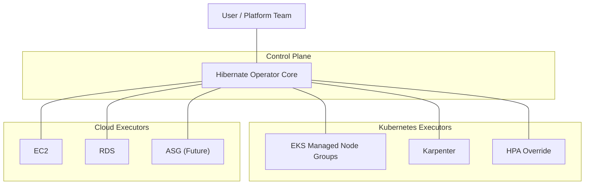

# Kubernetes-Based Cloud Hibernation Operator – Workplan

## Problem statement

Design and implement a Kubernetes Operator that acts as a centralized manager for performing full infrastructure shutdown during user-defined off-hours, and restoring resources during on-hours.

## Registry pattern

The operator must:

- Support time-based scheduling with timezone awareness
- Perform full EKS worker node hibernation
  - Managed Node Groups (scale to zero)
  - Karpenter-managed nodes (delete and restore)
- Extend beyond Kubernetes to stoppable cloud resources
  - EC2
  - RDS
  - ASG (future)

- Follow an extension / executor model
- Track state, progress, and restore metadata
- Be declarative and GitOps-friendly

This system focuses on intent-driven infrastructure suspension, not cost optimization or autoscaling replacement.

## High-Level Architecture



The Hibernator Operator Core is responsible for:

- Evaluates user-defined schedules
- Manages hibernation lifecycle state
- Enforces dependency ordering
- Aggregates execution status
- Selects appropriate executors
- Dispatches execution tasks

Key idea:
> Core never knows “how” to shutdown something — it only knows “what intent” to apply.

## Core concepts & responsibilities

### Core Operator (Brain)

#### Responsibilities

- Evaluate time-based intent
- Maintain task lifecycle
- Enforce ordering & safety
- Dispatch work to executors
- Persist restore metadata
- Surface status & errors

#### Explicitly NOT responsible for

- AWS SDK logic
- Resource-specific semantics
- Retry strategy per service

### Executor (Hands)

Each executor:

- Implements a well-defined contract
- Owns idempotency
- Knows how to:

  - Shutdown
  - Capture restore state
  - Wake up

Executors can be:

- In-tree (official)
- Out-of-tree (custom teams)

## CRD design (example)

**`CloudProvider` Connector** (Access)

```yaml
apiVersion: connector.hibernator.ardikabs.com/v1alpha1
kind: CloudProvider
metadata:
  name: aws-stg
  namespace: hibernator-system
spec:
  type: aws
  aws:
    accountId: "123456789012"
    region: ap-southeast-3
    # Optional: AssumeRoleArn can be used with both auth methods
    assumeRoleArn: arn:aws:iam::123456789012:role/hibernator-target

    auth:
      # At least one of the following must be specified

      serviceAccount: {}
        # IRSA: Empty struct indicates use pod's ServiceAccount identity

      # static:
      #   secretRef:
      #     name: stg-aws-access-key
      #     namespace: hibernator-system
---
apiVersion: connector.hibernator.ardikabs.com/v1alpha1
kind: K8SCluster
metadata:
  name: stg-eks-1
  namespace: hibernator-system
spec:
  # Reference to the cloud provider used to manage this cluster
  # It only empty when using generic kubernetes (k8s) type
  providerRef:
    name: aws-stg
    namespace: hibernator-system

  # Exactly one cluster type must be specified
  # Supported types include: eks, gke, and generic kubernetes (k8s)
  eks:
    name: stg-eks-1
    region: ap-southeast-3

  # Kubernetes API access configuration for this cluster
  k8s:
    kubeconfigRef:
      name: kubeconfig-stg-eks-1
      namespace: hibernator-system
```

**`HibernatePlan`** (Intent)

The `HibernatePlan` expresses intent for coordinated suspension and restore across heterogeneous resources. The plan supports configurable execution strategies (sequential, bounded parallelism, staged groups, or an explicit DAG) and per-target dependencies so the controller can safely orchestrate complex workflows while bounding concurrency and preserving restore metadata.

Example: full-featured `HibernatePlan` with DAG-style execution

```yaml
apiVersion: hibernator.ardikabs.com/v1alpha1
kind: HibernatePlan
metadata:
  name: stg-offhour
spec:
  schedule:
    timezone: Asia/Jakarta
    offHours:
      - start: "20:00"
        end: "06:00"
        daysOfWeek: ["MON", "TUE", "WED", "THU", "FRI"]

  # Global execution strategy for this plan
  execution:
    strategy:
      type: DAG            # Sequential | Parallel | DAG | Staged

      # maxConcurrency applies to:
      # - When `type: DAG` use `maxConcurrency` to limit concurrent nodes
      # - When `type: Parallel` use `maxConcurrency` to bound parallelism
      maxConcurrency: 3    # optional bound for Parallel/DAG

      # Explicit DAG edges (from -> to). Only valid when `type: DAG` —
      # controller will validate acyclicity and that referenced targets exist.
      dependencies:
        - from: stg-db
          to: stg-cluster
        - from: stg-cluster
          to: stg-ec2-non-asg

      # - When `type: Staged` define `stages:` (each stage can be parallel)
      # Example (Staged):
      # stages:
      #   - name: storage
      #     parallel: true
      #     targets: [stg-db]
      #   - name: compute
      #     parallel: true
      #     maxConcurrency: 2
      #     targets: [stg-cluster, stg-ec2-non-asg]

  behavior:
    mode: Strict          # Strict | BestEffort
    failFast: true

  targets:
    - name: stg-db
      type: rds
      connectorRef:
        kind: CloudProvider
        name: aws-stg
      parameters:
        snapshotBeforeStop: true

    - name: stg-cluster
      type: eks
      connectorRef:
        kind: K8SCluster
        name: stg-eks-1
      parameters:
        computePolicy:
          mode: Both
          order: [karpenter, managedNodeGroups]

        karpenter:
          nodePools: ["default"] # optional, empty = all NodePools
          strategy: DeleteNodes

        managedNodeGroups:
          strategy: ScaleToZero

    - name: stg-ec2-non-asg
      type: ec2
      connectorRef:
        kind: CloudProvider
        name: aws-stg
      parameters:
        selector:
          tags:
            Hibernate: "true"

status:
  phase: Active | Hibernating | WakingUp | Error
  lastTransitionTime: ...
  executions:
    - target: rds/stg-db
      executor: rds
      state: Completed
      startedAt: ...
      finishedAt: ...
      attempts: 1
      message: "Snapshot and stop completed"
    - target: eks/stg-cluster
      executor: eks-node
      state: InProgress
      startedAt: ...
      attempts: 1
      message: "Deleting karpenter nodes"
    - target: ec2/stg-ec2-non-asg
      executor: ec2
      state: Pending
      message: "Waiting on dependency: stg-cluster"

## Execution runners (Jobs) and streaming

Design note: each `HibernatePlan` target should be executed in an isolated runner pod launched as a Kubernetes `Job`. The runner pod encapsulates the executor invocation, captures restore metadata, and streams logs back to the control plane. This isolates resource permissions, enforces timeouts, and makes execution observable and retryable using native Kubernetes semantics.

Key responsibilities of the runner pod:

- Obtain credentials/connection from the referenced connector (service account, kubeconfig, or cloud creds).
- Execute the executor binary or container image with the target `parameters`.
- Produce restore metadata (JSON blob) to an artifact location (k8s `ConfigMap`, PVC, or object store) and return a durable reference.
- Stream logs and progress back to the control plane using a pluggable transport (gRPC client-streaming by default; webhook HTTP as fallback).

Default/simple lifecycle (recommended)

- For the default/simple dispatch mode the controller will create per-execution helper resources scoped to the Job:
  - A dedicated `ServiceAccount` (or projected short-lived token) for the runner pod.
  - A `Secret` (connector creds) mounted or injected for the duration of the Job.
  - A temporary `ConfigMap` (optional) used to store restore hints or small metadata required for the restore phase.

- Lifecycle rules:
  - The `Secret` and `ServiceAccount` are created when the Job is scheduled and cleaned up after the Job completes (success or terminal failure).
  - The `ConfigMap` used to persist restore hints **must** survive until the overall `HibernatePlan` completes wake-up; therefore the controller will keep that ConfigMap (or move its contents to a durable artifact store) and record its reference in the `HibernatePlan` status.
  - All created helper resources are namespaced and annotated with the plan/target so they can be garbage-collected safely by the controller.

Implementation notes:

- Creating ephemeral SA/Secrets per-Job scopes permissions and reduces blast radius.
- Persisting small restore hints in a namespaced `ConfigMap` allows the wake-up flow to read minimal state without depending on external object stores (optional).
- For larger restore metadata use the object-store artifact path and store the object reference in the `ConfigMap` or directly in `status`.

Example Job template (conceptual):

```yaml
apiVersion: batch/v1
kind: Job
metadata:
  generateName: hibernate-runner-
spec:
  backoffLimit: 3
  template:
    metadata:
      annotations:
        hibernator/plan: "stg-offhour"
        hibernator/target: "stg-db"
    spec:
      serviceAccountName: hibernator-runner-sa
      containers:
        - name: runner
          image: ghcr.io/hibernator/runner:latest
          args: ["--target", "stg-db", "--plan", "stg-offhour"]
          env:
            - name: CONNECTOR_SECRET
              valueFrom:
                secretKeyRef: { name: connector-secret, key: creds }
            # The controller injects the following at Job creation time:
            # - HIBERNATOR_CONTROL_PLANE_ENDPOINT: control-plane gRPC/webhook endpoint
            # - HIBERNATOR_EXECUTION_ID: unique execution id for this run
            # - HIBERNATOR_STREAM_AUTH_TOKEN: optional short-lived token (mounted via Secret)
            - name: HIBERNATOR_CONTROL_PLANE_ENDPOINT
              value: "<CONTROL_PLANE_ENDPOINT>" # controller will replace with actual endpoint
            - name: HIBERNATOR_EXECUTION_ID
              value: "<EXECUTION_ID>" # controller will inject a per-execution id
            - name: HIBERNATOR_STREAM_AUTH_TOKEN
              valueFrom:
                secretKeyRef: { name: execution-auth-secret, key: token }
      restartPolicy: Never
```

Streaming model (recommended):

- gRPC (preferred): runner opens a gRPC client stream to the control plane's `ExecutionService.StreamLogs(ExecutionId)` RPC and sends log/progress records. This allows ordered, low-latency delivery, checkpointing, and efficient binary payloads for restore artifacts if desired.
- Webhook (fallback): runner POSTs log events and final metadata to a pre-signed control-plane HTTP endpoint when gRPC is not available or desired. Note: this is an application-level HTTP callback, not a Kubernetes admission webhook.

Security and permissions

- Kubernetes identity: each runner uses a dedicated `ServiceAccount` for Kubernetes API access, RBAC enforcement, and — via IRSA — cloud IAM roles. The SA is ephemeral (created per-Job) or shared with minimal RBAC scope.
- Control-plane streaming auth: the runner's pod spec includes a **projected ServiceAccount token** with a custom audience (e.g., `hibernator-control-plane`). At Job creation the controller sets `HIBERNATOR_EXECUTION_ID` and configures a projected volume:

```yaml
volumes:
  - name: stream-token
    projected:
      sources:
        - serviceAccountToken:
            audience: hibernator-control-plane
            expirationSeconds: 600
            path: token
```

The runner reads the token from `/var/run/secrets/stream/token` and presents it (along with the execution id) when opening gRPC/webhook streams.
- Validation: on stream open the control plane calls `TokenReview` with the presented token and verifies the audience is `hibernator-control-plane` and the token is unexpired. The controller binds the validated identity to the execution ledger entry.
- Lifecycle and cleanup: projected tokens are auto-rotated by the kubelet and expire after `expirationSeconds`. No Secret objects to create or clean up — reducing operational overhead.
- Optional stronger auth: issue short-lived mTLS client certificates (CSR flow) instead of projected tokens for higher assurance; this adds complexity but removes bearer-token replay risk.

Rationale: using projected SA tokens with a custom audience leverages Kubernetes-native token issuance and rotation, avoids Secret churn, and integrates with TokenReview for validation.

Status integration

- `status.executions[]` entries should include `jobRef` (namespace/name) and `logsRef` (gRPC stream id or webhook delivery id) so operators can deep-link into the Kubernetes Job and the control-plane log stream.
- Restore metadata should be saved to a durable artifact and referenced in `status.executions[].restoreRef`.

Status references for Job-created helpers

- `status.executions[].serviceAccountRef`: namespace/name of the ephemeral ServiceAccount created for the Job.
- `status.executions[].connectorSecretRef`: namespace/name of the Secret used to hold connector credentials for the Job (cleaned after Job unless flagged to keep).
- `status.executions[].restoreConfigMapRef`: namespace/name of the ConfigMap used to hold restore hints that must be preserved until wake-up.

These fields ensure the wake-up reconciliation can locate the artifacts and credentials needed to restore resources and provide an auditable trail.

Retries & idempotency

- Jobs are retried according to `backoffLimit` and plan-level retry semantics (executor may implement idempotency). The control plane should correlate Job runs to a single execution ledger entry and increment `attempts`.

Pluggability

- Executors remain pluggable: the runner container is a thin shim that loads the executor implementation (in-tree or sidecar) or invokes an external binary. Transport (gRPC vs webhook) is a pluggable option in the plan/connector.
```

Simpler alternative: staged execution (groups with optional parallelism)

```yaml
execution:
  strategy:
    type: Staged
  stages:
    - name: storage
      parallel: true
      targets: [stg-db]
    - name: compute
      parallel: true
      maxConcurrency: 2
      targets: [stg-cluster, stg-ec2-non-asg]
```

Status ledger guidance

- `status.executions[]` should be a canonical ledger with one entry per target that includes: `target`, `executor`, `state` (Pending|Running|Completed|Failed), `startedAt`, `finishedAt`, `attempts`, `message`, and an optional `logsRef` or `jobRef` for deep linking to executor logs.
- `status.overall` (optional) can summarize progress and show current concurrency usage.

Validation rules (controller responsibilities)

- Validate `execution.strategy.type` is one of the supported values.
- Enforce `maxConcurrency` is a positive integer when present.
- Validate `dependencies` form a DAG (reject cycles) and all referenced targets exist.
- Validate there are no conflicting stage + dependencies declarations (choose one semantic surface).

Why this model vs CronJob-style parallelism

- Safety: explicit dependencies and a controller-managed DAG prevent race conditions (e.g., snapshot before cluster shutdown).
- Observability: a central ledger with timestamps and links to logs provides a single source of truth.
- Control: `maxConcurrency` prevents API throttling or cloud rate-limit issues.
- Extensibility: supports mixed executors (Kubernetes, RDS, EC2) with different semantics and idempotency needs.

When to consider CronJob-like execution: only for trivial, homogeneous, independent tasks where minimal coordination is needed; avoid for coordinated hibernation and restore workflows.

Key design choices here

- schedule is declarative and timezone-aware
- targets are intent, not implementation
- options are executor-scoped (opaque to core)
- `status.executions` is a fan-out ledger

## Executor / extension model

Define a contract, not inheritance.

### Executor interface (conceptual)

```go
type Executor interface {
    Type() string
    Validate(spec ExecutorSpec) error

    Shutdown(ctx context.Context, spec ExecutorSpec) (RestoreData, error)
    WakeUp(ctx context.Context, restore RestoreData) error
}
```


### Executor registry

- Executors register themselves:

```go
registry.Register("eks", eksExecutor)
registry.Register("rds", rdsExecutor)
```

- Core does:

```go
executor := registry.Get(target.Type)
executor.Shutdown(...)
```

- Restore Point:

```go
{
  "managedNodeGroups": {
    "ng-1": { "desired": 3, "min": 1, "max": 5 }
  },
  "karpenter": {
    "nodePools": ["default"]
  }
}
```

## Operational Flow

### A. Shutdown (off-hour begins)

1. Schedule reconciliation
   - Operator detects now ∈ offHours
2. Plan enters Hibernating
3. Dependency ordering
   - Kubernetes nodes → compute → databases
4. Executor dispatch
   - Each target invoked independently
5. State persistence
   - Restore metadata saved
6. Completion
   - Phase → **Hibernated**

### B. Wake-up (off-hour ends)

1. Operator detects off-hour expired
2. Phase → **WakingUp**
3. Reverse execution order
4. Restore using stored metadata
5. Health checks (optional)
6. Phase → **Active**

## Safety, constraints, and non-goals

### Explicit constraints

- No guarantee of zero cost (some services can’t stop)
- No application-level quiescing (unless extended)
- No autoscaling intelligence replacement

### Safety rails

- Dry-run mode
- Manual override annotation
- Max retry per executor
- Partial success tolerance (BestEffort mode)

### Non-goals

- Not a scheduler replacement
- Not a cost-optimization engine
- Not a backup system (but can trigger one)

## End-to-end example

> Scenario:
> Weekday at 20:00 WIB, lower environment (DEV/STG) enters off-hour

- Operator detects time window
- `HibernatePlan`/stg-offhour reconciles
- EKS executor:
  - Delete Karpenter nodes
  - Save config
  - Scale MNG → 0
- RDS executor:
  - Snapshot → Stop
- EC2 executor:
  - Stop tagged instances
  - Status reflects partial success

- At 06:00 WIB:
  - Restore in reverse order
  - Cluster becomes schedulable
  - Apps come back naturally

---

## Implementation Progress

### MVP Phase 1 - Core Infrastructure ✅

| Component | Status | Notes |
|-----------|--------|-------|
| Go module setup | ✅ | go.mod with k8s.io/api v0.34.0 |
| Makefile | ✅ | Standard controller tooling |
| Dockerfile | ✅ | Multi-stage build |
| CRD types | ✅ | HibernatePlan, CloudProvider, K8SCluster |
| Scheduler/Planner | ✅ | DAG-based execution ordering |
| AWS Executors | ✅ | EKS, RDS, EC2 executors |
| HibernatePlan Controller | ✅ | Phase-based reconciliation |
| Runner binary | ✅ | CLI with executor invocation |

### MVP Phase 2 (P0/P1) - Core Features ✅

| Component | Status | Notes |
|-----------|--------|-------|
| Cron schedule parsing | ✅ | robfig/cron/v3 with timezone support |
| Restore data persistence | ✅ | ConfigMap-based RestoreManager |
| Validation webhook | ✅ | DAG cycle detection, cron validation |
| Integration tests | ✅ | envtest-based controller tests |
| Runner ServiceAccount | ✅ | IRSA/workload identity annotations |

### MVP Phase 3 (P2) - Streaming Infrastructure ✅

| Component | Status | Notes |
|-----------|--------|-------|
| Proto/types definitions | ✅ | ExecutionService, LogEntry, ProgressReport |
| TokenReview auth | ✅ | Validator with audience check |
| gRPC interceptors | ✅ | Unary and streaming auth |
| gRPC streaming server | ✅ | ExecutionServiceServer |
| Webhook callback server | ✅ | HTTP fallback with TokenReview auth |
| gRPC client | ✅ | Log buffering, heartbeat, progress |
| Webhook client | ✅ | HTTP fallback with same interface |
| Auto-select client | ✅ | Tries gRPC, falls back to webhook |
| Runner streaming integration | ✅ | Progress, completion, error reporting |

### Remaining Work

| Component | Status | Notes |
|-----------|--------|-------|
| Runner integration | ✅ | Streaming fully integrated with progress, logs, completion |
| Karpenter executor | ✅ | NodePool scaling implementation complete |
| Restore data consumption | ✅ | Load RestoreData during WakeUp complete |
| GCP executor implementation | ⏳ | GKE and Cloud SQL API integration pending |
| E2E tests | ⏳ | Full hibernation cycle tests |
| Helm chart | ⏳ | Deployment packaging |
| Documentation | ⏳ | User guide, API reference |
| CI/CD | ⏳ | GitHub Actions workflow |

### Key Implementation Decisions

1. **Auth model**: Projected SA token with `hibernator-control-plane` audience, validated via TokenReview API
2. **Streaming transport**: gRPC preferred, HTTP webhook fallback for restricted environments
3. **Restore persistence**: ConfigMap-based storage with namespace/plan/target keys
4. **Execution ordering**: Controller-managed DAG with Kahn's algorithm for topological sort
5. **Runner isolation**: Kubernetes Jobs with ephemeral ServiceAccounts and IRSA
6. **Schedule format**: User-friendly start/end time windows (HH:MM) with day-of-week array, converted internally to cron expressions for scheduler compatibility

---

## Next Steps & Open Items

### Immediate Tasks (Current Sprint)

1. **Schedule Format Migration** ✅
   - Status: COMPLETED
   - Changes:
     - API schema updated from `cron`+`duration` to `start`+`end`+`daysOfWeek` format
     - Validation webhook updated with HH:MM regex pattern and day-of-week validation
     - Conversion layer implemented in `internal/scheduler/schedule.go` (`ConvertOffHoursToCron`)
     - Controller updated to use conversion function before scheduler evaluation
     - All webhook tests updated to new format

2. **Test Coverage for Schedule Conversion** 🔄
   - Status: IN PROGRESS
   - Next: Add unit tests for `ConvertOffHoursToCron()` function
   - Test cases needed:
     - Valid single window conversion
     - Multiple day-of-week handling
     - Edge cases: overnight windows (end < start)
     - Invalid time format handling
     - Invalid day name handling

3. **Sample Configuration Updates** ⏳
   - Status: PENDING
   - File: `config/samples/hibernateplan_samples.yaml`
   - Action: Update remaining 2 sample configurations to new schedule format

4. **Controller Tests** ⏳
   - Status: PENDING
   - Update `internal/controller/hibernateplan_controller_test.go` to use new schedule format
   - Verify schedule evaluation with converted cron expressions

### Planned Enhancements

5. **Multiple Window Support** 📋
   - Current: Only first OffHourWindow is used
   - TODO: Support multiple windows by generating multiple cron expressions or finding common patterns
   - Complexity: High - requires cron expression merging logic

6. **Overnight Window Handling** 📋
   - Current: Treats overnight windows (e.g., 20:00-06:00) as same-day
   - TODO: Properly handle windows that cross midnight
   - Impact: Schedule evaluation accuracy for late-night hibernation

---
