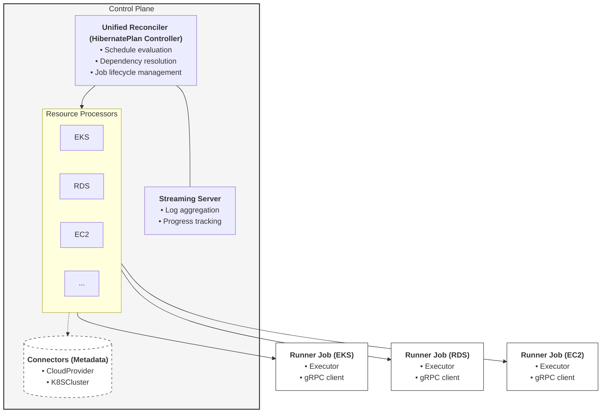

# Architecture

Hibernator follows a **brain-and-hands** architecture where the control plane (brain) makes decisions and runner jobs (hands) perform actions.

## High-Level Overview

## Control Plane

The control plane is the operator's brain. It runs inside the Kubernetes cluster as a Deployment and adopts a **unified reconciler pattern**. While multiple Custom Resources (CRs) exist, they are centrally managed by the `HibernatePlan` controller, which coordinates the lifecycle of the entire hibernation ecosystem.

### Unified Reconciler & Processors

The `HibernatePlan` controller acts as a central orchestrator. It dispatches work to resource-specific **processors** that understand how to handle the different components of a plan. 

- **Lifecycle Oriented**: Most resources are currently bounded by their association with a `HibernatePlan`. When a plan triggers, the controller uses the appropriate processor for each target.
- **Connectors (Metadata Only)**: resources like `CloudProvider` and `K8SCluster` currently serve as **metadata-only containers**. They hold credentials and connection details but do not yet have their own active lifecycle processors for tasks like health checking or connectivity validation beyond their use within a `HibernatePlan` execution.

The controller is specifically responsible for:

### Schedule Evaluation

The controller continuously monitors `HibernatePlan` resources and evaluates their schedules against the current time (timezone-aware). When a schedule window begins or ends, it triggers the appropriate operation.

### Dependency Resolution

Before executing targets, the controller resolves execution order:

- **Sequential**: Targets execute one at a time in declaration order
- **Parallel**: All targets execute simultaneously (bounded by `maxConcurrency`)
- **DAG**: Topological sort using Kahn's algorithm determines order based on explicit dependencies
- **Staged**: Targets are grouped into stages that execute in order; within each stage, targets can be parallel or sequential

### Job Lifecycle Management

For each target, the controller creates a Kubernetes Job containing a runner pod. It monitors Job completion and failure, updates the execution ledger, and manages retries with exponential backoff.

### Status Ledger

The controller maintains a per-target execution ledger in the `HibernatePlan` status, recording timestamps, attempt counts, error messages, and references to logs and restore data.

## Runner Jobs

Runner jobs are the operator's hands. Each runner is an isolated Kubernetes Job that:

1. Receives its assignment (target type, parameters, operation) via environment variables
2. Loads the appropriate executor implementation
3. Executes the shutdown or wakeup operation
4. Streams logs and progress back to the control plane via gRPC
5. Persists restore metadata in a ConfigMap (during shutdown)
6. Reads restore metadata from the ConfigMap (during wakeup)

### Security Model

- **Ephemeral ServiceAccount**: Each Job gets a scoped ServiceAccount
- **IRSA**: AWS credentials are injected via IAM Roles for Service Accounts
- **Projected Tokens**: Custom audience (`hibernator-control-plane`) for streaming authentication
- **TokenReview**: The streaming server validates tokens via the Kubernetes TokenReview API

## Executors

Executors are pluggable components that contain the resource-specific logic for shutdown and wakeup. Each executor implements three operations:

| Operation | Purpose |
|-----------|---------|
| `Validate` | Verify parameters and connectivity before execution |
| `Shutdown` | Stop/scale-down the resource, capturing restore metadata |
| `WakeUp` | Restore the resource using saved metadata |

### Built-in Executors

| Executor | Resource | Provider | Connector | Status |
|----------|----------|----------|-----------|--------|
| `eks` | EKS Managed Node Groups | AWS | CloudProvider | :white_check_mark: Ready |
| `karpenter` | Karpenter NodePools | Kubernetes | K8SCluster | :white_check_mark: Ready |
| `ec2` | EC2 Instances | AWS | CloudProvider | :white_check_mark: Ready |
| `rds` | RDS Instances & Clusters | AWS | CloudProvider | :white_check_mark: Ready |
| `workloadscaler` | Kubernetes Workloads | Kubernetes | K8SCluster | :white_check_mark: Ready |
| `noop` | None (testing) | For Development Purpose | Any | :white_check_mark: Ready |
| `gke` | GKE Node Pools | GCP | K8SCluster | :construction: Not Implemented |
| `cloudsql` | Cloud SQL Instances | GCP | CloudProvider | :construction: Not Implemented |

For detailed information about each executor, see [Executors](executors.md).

## Streaming Infrastructure

The control plane runs a gRPC server for real-time communication with runners:

- **Log streaming**: Runners stream execution logs back to the controller
- **Progress reporting**: Runners report step-by-step progress
- **Fallback**: HTTP webhook transport is available for environments where gRPC is restricted

## Restore Metadata

During shutdown, executors capture the current state of resources:

- EKS: Node group desired sizes, min/max sizes
- Karpenter: NodePool replica counts and limits
- RDS: Instance state (running/stopped)
- EC2: Instance IDs and states

This metadata is stored in ConfigMaps namespaced as `restore-data-{plan-name}` with keys formatted as `{executor}_{target-name}`. During wakeup, the executor reads this metadata to restore resources to their exact pre-hibernation state.
