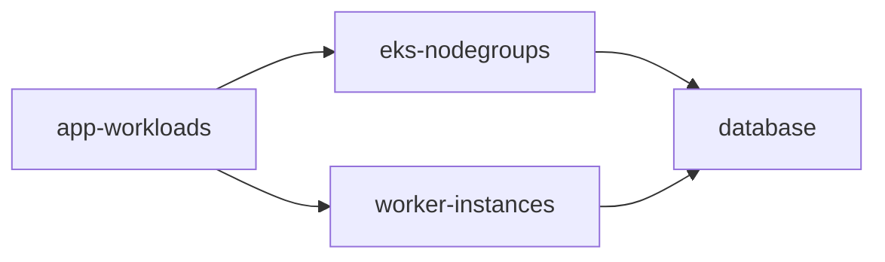

# Dependency-Ordered Shutdown (DAG)

You run an e-commerce production-like environment. Shutdown order matters here:

1. **Applications first** — scale the `shopfront` and `checkout` deployments to zero so no pod is mid-request when the infrastructure moves.
2. **Compute second** — only after apps are gone, shrink the EKS node groups and stop the worker EC2 instances.
3. **Database last** — only after every database client is gone, take the final snapshot and stop `prod-postgres`.

And in the morning, the exact reverse: database up *first*, applications up *last*. This is what the `DAG` strategy is for.

## Goal

- Encode "A must finish before B starts" relationships explicitly, and let the controller work out execution levels.
- Shutdown: `app-workloads` → `eks-nodegroups` + `worker-instances` → `database`.
- Wakeup: automatically reversed — `database` → `eks-nodegroups` + `worker-instances` → `app-workloads`.

## The Dependency Graph



An edge `from: A, to: B` means **A completes before B starts during shutdown**. During wakeup the order is reversed, so dependencies are restored before their dependents.

## Configuration

```yaml
apiVersion: hibernator.ardikabs.com/v1alpha1
kind: CloudProvider
metadata:
  name: aws-production
  namespace: hibernator-system
spec:
  type: aws
  aws:
    accountId: "456789012345"
    region: ap-southeast-3
    assumeRoleArn: arn:aws:iam::456789012345:role/hibernator-runner
    auth:
      serviceAccount: {}
---
apiVersion: hibernator.ardikabs.com/v1alpha1
kind: K8SCluster
metadata:
  name: prod-eks
  namespace: hibernator-system
spec:
  providerRef:
    name: aws-production
    namespace: hibernator-system
  eks:
    name: prod-cluster
    region: ap-southeast-3
---
apiVersion: hibernator.ardikabs.com/v1alpha1
kind: HibernatePlan
metadata:
  name: prod-ordered
  namespace: hibernator-system
spec:
  schedule:
    timezone: "Asia/Jakarta"
    offHours:
      - start: "23:00"
        end: "05:00"
        daysOfWeek: ["MON", "TUE", "WED", "THU", "FRI", "SAT", "SUN"]

  execution:
    strategy:
      type: DAG
      maxConcurrency: 2
      dependencies:
        - from: app-workloads
          to: eks-nodegroups
        - from: app-workloads
          to: worker-instances
        - from: eks-nodegroups
          to: database
        - from: worker-instances
          to: database

  behavior:
    mode: Strict
    retries: 3

  targets:
    - name: app-workloads
      type: workloadscaler
      connectorRef:
        kind: K8SCluster
        name: prod-eks
      parameters:
        namespace:
          literals: [shopfront, checkout]
        includedGroups: [Deployment]
        awaitCompletion:
          enabled: true

    - name: eks-nodegroups
      type: eks
      connectorRef:
        kind: CloudProvider
        name: aws-production
      parameters:
        clusterName: prod-cluster
        nodeGroups: []
        awaitCompletion:
          enabled: true
          timeout: "10m"

    - name: worker-instances
      type: ec2
      connectorRef:
        kind: CloudProvider
        name: aws-production
      parameters:
        selector:
          tags:
            Component: worker
        awaitCompletion:
          enabled: true

    - name: database
      type: rds
      connectorRef:
        kind: CloudProvider
        name: aws-production
      parameters:
        selector:
          instanceIds: [prod-postgres]
        snapshotBeforeStop: true
        awaitCompletion:
          enabled: true
          timeout: "15m"
```

```bash
kubectl apply -f prod-ordered.yaml
```

## How It Executes

The controller topologically sorts the graph (Kahn's algorithm) and executes it in **levels**, bounded by `maxConcurrency`:

**Shutdown — 23:00**

| Level | Targets | Why |
|-------|---------|-----|
| 0 | `app-workloads` | No upstream dependencies — starts immediately |
| 1 | `eks-nodegroups`, `worker-instances` | Start only after `app-workloads` completes; run in parallel |
| 2 | `database` | Starts only after *both* compute targets complete — snapshot taken with zero active clients |

**Wakeup — 05:00** — the DAG runs in reverse: `database` first, then `eks-nodegroups` + `worker-instances` in parallel, then `app-workloads`. Your applications never start before the database accepts connections.

!!! note "Why the database is last down, first up"
    `snapshotBeforeStop: true` produces a clean final snapshot precisely *because* every client disconnected first. On wakeup, the RDS instance takes minutes to become available — starting it first means compute and apps come up to a database that is already serving.

!!! tip "Cycles are rejected at admission"
    The validation webhook detects dependency cycles (`A → B → A`) when you apply the plan and rejects it. See [Cycle Detection](../user-guides/execution-strategies.md#cycle-detection).

If you combine DAG with `BestEffort`, a failed target causes its downstream dependents to be marked `Aborted` (not `Failed`) and skipped, while independent branches continue — see [Tolerating Partial Failures](partial-failure-besteffort.md).

## Verification

Watch the ordering happen via the ledger's `startedAt` timestamps:

```bash
kubectl get hibernateplan prod-ordered -n hibernator-system \
  -o jsonpath='{range .status.executions[*]}{.target}{"\t"}{.state}{"\t"}{.startedAt}{"\n"}{end}'
```

```
app-workloads     Completed    2026-07-23T23:00:05Z
eks-nodegroups    Running      2026-07-23T23:04:12Z
worker-instances  Running      2026-07-23T23:04:15Z
database          Pending
```

`database` only leaves `Pending` once both compute targets are `Completed`.

## Variations

- **Karpenter in the mix** — hibernate Karpenter NodePools *before* managed node groups so Karpenter does not reschedule pods onto nodes you are about to remove: add a `karpenter-pools` target and a `from: karpenter-pools, to: eks-nodegroups` edge. See the [combined pattern](../user-guides/karpenter-executor.md#combined-eks-karpenter-with-dependencies).
- **Coarser tiers** — if your ordering is really "tier 1, then tier 2, then tier 3" with groups inside each tier, [Staged](staged-hibernation-criticality.md) may express it more naturally.
- **Simple linear chain** — `Sequential` executes targets in list order. It is equivalent to a DAG that is a single chain — use it when you do not need intra-level parallelism.

## Next Steps

- [Execution Strategies](../user-guides/execution-strategies.md) — full strategy semantics including DAG edge rules
- [Staged Hibernation by Criticality](staged-hibernation-criticality.md) — the tiered alternative
- [Event-Mode Overrides](event-mode-overrides.md) — change what runs during special events
