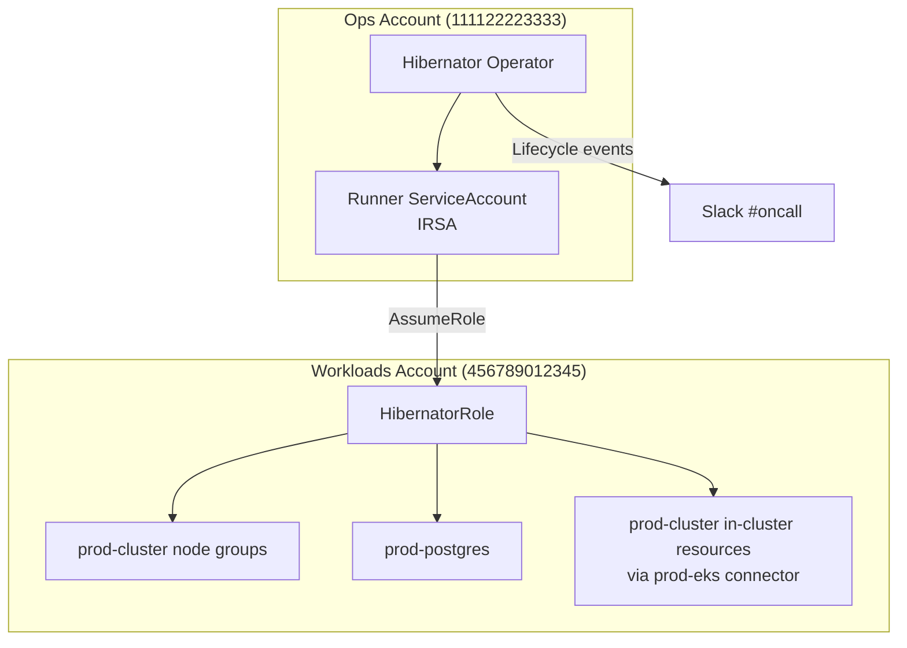

# Production-Grade Setup (Capstone)

You are on the platform team, rolling out hibernation for the **production** environment. The constraints are real this time:

- The Hibernator operator runs in the **ops account** (`111122223333`); production resources live in the **workloads account** (`456789012345`). Cross-account access must go through role assumption — no long-lived credentials.
- Shutdown must be **ordered**: applications → compute → database.
- The on-call channel must know when cycles start, succeed, and fail — in Slack.
- A code-freeze week is coming, and governance wants the schedule override on record.

This capstone composes everything from the earlier scenarios into one setup.

## Architecture



## Step 1 — Connectors (cross-account)

The `aws-workloads` CloudProvider authenticates with the runner pod's IRSA identity from the ops account, then **assumes `HibernatorRole` in the workloads account** before touching anything. The `prod-eks` K8SCluster inherits that authentication through `providerRef`.

```yaml
apiVersion: hibernator.ardikabs.com/v1alpha1
kind: CloudProvider
metadata:
  name: aws-workloads
  namespace: hibernator-system
spec:
  type: aws
  aws:
    accountId: "456789012345"
    region: ap-southeast-3
    assumeRoleArn: arn:aws:iam::456789012345:role/HibernatorRole
    auth:
      serviceAccount: {}
---
apiVersion: hibernator.ardikabs.com/v1alpha1
kind: K8SCluster
metadata:
  name: prod-eks
  namespace: hibernator-system
spec:
  providerRef:
    name: aws-workloads
    namespace: hibernator-system
  eks:
    name: prod-cluster
    region: ap-southeast-3
```

See [Connectors](../concepts/connectors.md) for the IRSA trust-policy setup and static-credential fallback.

## Step 2 — The Plan (ordered, labeled)

Two details matter beyond the DAG shape:

- **`metadata.labels`** — the notification resource matches plans by label. No labels, no alerts.
- **Opt-in workloads** — production workloads hibernate only when explicitly labeled `hibernator.ardikabs.com/enabled: "true"`.

```yaml
apiVersion: hibernator.ardikabs.com/v1alpha1
kind: HibernatePlan
metadata:
  name: prod-main
  namespace: hibernator-system
  labels:
    env: production
    team: platform
spec:
  schedule:
    timezone: "Asia/Jakarta"
    offHours:
      - start: "23:00"
        end: "05:30"
        daysOfWeek: ["MON", "TUE", "WED", "THU", "FRI", "SAT", "SUN"]

  execution:
    strategy:
      type: DAG
      maxConcurrency: 2
      dependencies:
        - from: app-workloads
          to: karpenter-pools
        - from: karpenter-pools
          to: eks-nodegroups
        - from: eks-nodegroups
          to: database

  behavior:
    mode: Strict
    retries: 3

  targets:
    - name: app-workloads
      type: workloadscaler
      connectorRef:
        kind: K8SCluster
        name: prod-eks
      parameters:
        namespace:
          selector:
            environment: production
        workloadSelector:
          matchExpressions:
            - key: hibernator.ardikabs.com/enabled
              operator: In
              values: ["true"]
        includedGroups: [Deployment]
        awaitCompletion:
          enabled: true

    - name: karpenter-pools
      type: karpenter
      connectorRef:
        kind: K8SCluster
        name: prod-eks
      parameters:
        nodePools: []
        awaitCompletion:
          enabled: true
          timeout: "5m"

    - name: eks-nodegroups
      type: eks
      connectorRef:
        kind: CloudProvider
        name: aws-workloads
      parameters:
        clusterName: prod-cluster
        nodeGroups: []
        awaitCompletion:
          enabled: true
          timeout: "10m"

    - name: database
      type: rds
      connectorRef:
        kind: CloudProvider
        name: aws-workloads
      parameters:
        selector:
          instanceIds: [prod-postgres]
        snapshotBeforeStop: true
        awaitCompletion:
          enabled: true
          timeout: "15m"
```

Shutdown order: `app-workloads` → `karpenter-pools` → `eks-nodegroups` → `database`. Wakeup reverses it. (Why Karpenter before managed node groups: [combined pattern](../user-guides/karpenter-executor.md#combined-eks-karpenter-with-dependencies).)

## Step 3 — Notifications (Slack to #oncall)

```yaml
apiVersion: v1
kind: Secret
metadata:
  name: slack-oncall
  namespace: hibernator-system
type: Opaque
stringData:
  config: |
    {
      "webhook_url": "https://hooks.slack.com/services/T00/B00/xxxx"
    }
---
apiVersion: hibernator.ardikabs.com/v1alpha1
kind: HibernateNotification
metadata:
  name: prod-oncall
  namespace: hibernator-system
spec:
  selector:
    matchLabels:
      env: production
  onEvents: [Start, Success, Failure, Recovery]
  sinks:
    - name: slack-oncall
      type: slack
      secretRef:
        name: slack-oncall
```

`Start` gives the channel a heads-up, `Success` closes the loop, `Failure` + `Recovery` page the humans. For thread-mode delivery, Telegram, or custom templates, see [Notifications](../user-guides/notifications.md) and the [sink reference](../reference/notification-sinks.md).

## Step 4 — Governance: the code-freeze week

Attach a `replace` exception for the freeze week — full-day hibernation, on record, auto-expiring:

```yaml
apiVersion: hibernator.ardikabs.com/v1alpha1
kind: ScheduleException
metadata:
  name: code-freeze-week
  namespace: hibernator-system
spec:
  planRef:
    name: prod-main
  type: replace
  validFrom: "2026-12-21T00:00:00Z"
  validUntil: "2026-12-27T23:59:59Z"
  windows:
    - start: "00:00"
      end: "23:59"
      daysOfWeek: ["MON", "TUE", "WED", "THU", "FRI", "SAT", "SUN"]
```

Deep dive: [Holiday Schedule Replacement](holiday-schedule-replacement.md) and [Composing Multiple Exceptions](../user-guides/composing-multiple-exceptions.md).

## Verification — Go-Live Checklist

1. **Notification matching** — `kubectl get hnotif prod-oncall -n hibernator-system` shows `Matched: 1`.
2. **First cycle** — watch the phase: `kubectl get hibernateplan prod-main -n hibernator-system -w`.
3. **Ordering** — confirm DAG levels via the ledger:

    ```bash
    kubectl get hibernateplan prod-main -n hibernator-system \
      -o jsonpath='{range .status.executions[*]}{.target}{"\t"}{.state}{"\t"}{.startedAt}{"\n"}{end}'
    ```

4. **Slack** — a `Start` message lands in #oncall at 23:00; `Success` follows when all targets complete.
5. **Morning** — wakeup runs in reverse order; plan returns to `Active`.
6. **Metrics** — add the operator's Prometheus metrics to your dashboards: [Metrics reference](../reference/metrics.md).

!!! tip "Do not skip the rehearsal"
    Run this exact plan shape through a [Dry-Run Rehearsal](dry-run-rehearsal.md) on the `noop` executor before the first production window. And keep the [Troubleshooting](../user-guides/troubleshooting.md) guide bookmarked for IRSA and permission issues on first contact with the workloads account.

## Next Steps

- [Notifications](../user-guides/notifications.md) — events, sinks, templates, thread mode
- [Error Recovery](../user-guides/error-recovery.md) — what happens when prod misbehaves
- [Metrics](../reference/metrics.md) — dashboards and alerts on the operator itself
