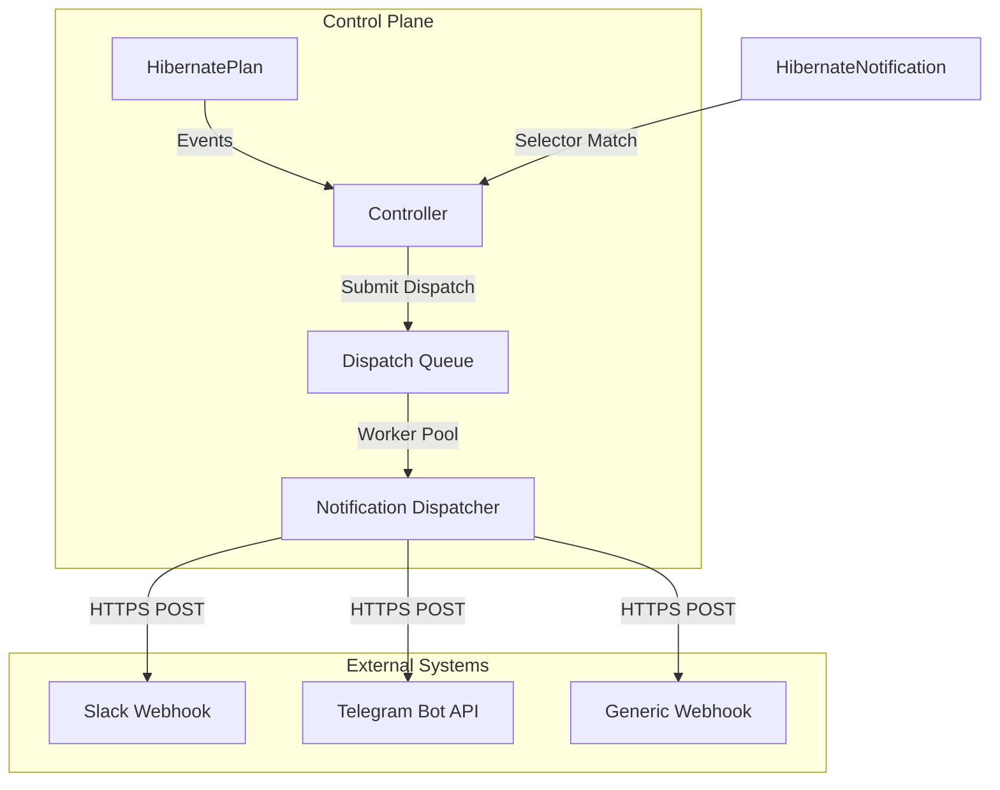

# Notifications

Hibernator can send real-time notifications when key events occur during the hibernation lifecycle — execution starting, success, failure, recovery attempts, and phase changes. Notifications are configured through the `HibernateNotification` custom resource and delivered to external systems like Slack and Telegram.

## How notifications work

The notification system is **decoupled from the reconciliation loop**. When a lifecycle event fires, the controller submits a dispatch request to an async worker pool. This design ensures notifications never block or slow down the core hibernation logic — delivery is fire-and-forget from the controller's perspective.

### Architecture Overview



Notifications are matched to plans via **label selectors**, the same pattern used by `ScheduleException`. A single `HibernateNotification` can target multiple plans, and a single plan can be matched by multiple notification resources.

## Quick Start

Setting up notifications involves three main steps: creating a configuration Secret, defining the notification resource, and matching it to your plans.

### 1. Create the Sink Secret

Each sink reads its configuration from a Kubernetes Secret. The Secret must contain a key named `config` with a JSON object holding the sink-specific settings.

=== "Slack"

    ```yaml
    apiVersion: v1
    kind: Secret
    metadata:
      name: slack-webhook
      namespace: hibernator-system
    type: Opaque
    stringData:
      config: |
        {
          "webhook_url": "https://hooks.slack.com/services/T00/B00/xxxx"
        }
    ```

=== "Telegram"

    ```yaml
    apiVersion: v1
    kind: Secret
    metadata:
      name: telegram-bot
      namespace: hibernator-system
    type: Opaque
    stringData:
      config: |
        {
          "token": "123456:ABC-DEF",
          "chat_id": "-100123456789",
          "parse_mode": "HTML"
        }
    ```

### 2. Create the HibernateNotification

```yaml
apiVersion: hibernator.ardikabs.com/v1alpha1
kind: HibernateNotification
metadata:
  name: prod-alerts
  namespace: hibernator-system
spec:
  selector:
    matchLabels:
      env: production
  onEvents:
    - Start
    - Success
    - Failure
  sinks:
    - name: slack-team
      type: slack
      secretRef:
        name: slack-webhook
```

### 3. Verify the Match

```bash
kubectl get hnotif prod-alerts -n hibernator-system
```

The `Matched` column shows how many plans currently match the label selector.

## Supported Notification Sinks

| Sink Type | Destination | Protocol | Authentication |
|-----------|-------------|----------|----------------|
| `slack` | Slack Channel | HTTPS | Webhook URL |
| `telegram` | Telegram Chat/Channel | HTTPS | Bot Token |
| `webhook` | Generic HTTP Endpoint | HTTPS | Headers (Bearer/API Key) |

## Notification Events

| Event | When It Fires | Use Case |
|-------|---------------|----------|
| **Start** | Right before hibernation or wakeup execution begins | "Heads up — resources going down" |
| **Success** | After all targets complete successfully | Confirmation that cycle finished |
| **Failure** | When retries are exhausted and plan enters Error phase | Alert on-call team |
| **Recovery** | Each time a retry attempt starts from Error | Track recovery progress |
| **PhaseChange** | On every phase transition | Audit trail (can be noisy) |
| **ExecutionProgress** | When an individual target's execution state changes (e.g., Pending→Running) | Track per-target progress in real time |

!!! tip "Choosing Events"
    For most use cases, subscribing to `Start`, `Success`, and `Failure` provides good coverage. Add `Recovery` if you want visibility into retry attempts. Add `ExecutionProgress` to track individual target state transitions (e.g., when a runner Job starts or completes). Use `PhaseChange` only for audit logging — it fires on every transition and can generate significant volume.

## Sink Configuration Reference

For the full configuration schema, Secret format, and built-in default templates for each sink type, see the [Notification Sink Reference](../reference/notification-sinks.md).

## Multiple Sinks

A single `HibernateNotification` can deliver to multiple sinks simultaneously. Each sink gets its own Secret and optional template:

```yaml
spec:
  selector:
    matchLabels:
      env: production
  onEvents:
    - Failure
    - Recovery
  sinks:
    - name: slack-oncall
      type: slack
      secretRef:
        name: slack-oncall-webhook
    - name: telegram-ops
      type: telegram
      secretRef:
        name: telegram-ops-bot
```

## Multiple Notifications per Plan

Different teams can create separate `HibernateNotification` resources targeting the same plans with different event subscriptions:

```yaml
# Team A: wants all events for audit
apiVersion: hibernator.ardikabs.com/v1alpha1
kind: HibernateNotification
metadata:
  name: audit-all-events
spec:
  selector:
    matchLabels:
      env: production
  onEvents: [Start, Success, Failure, Recovery, PhaseChange]
  sinks:
    - name: audit-slack
      type: slack
      secretRef:
        name: slack-audit-webhook
---
# Team B: only critical alerts
apiVersion: hibernator.ardikabs.com/v1alpha1
kind: HibernateNotification
metadata:
  name: oncall-alerts
spec:
  selector:
    matchLabels:
      tier: critical
  onEvents: [Failure]
  sinks:
    - name: oncall-telegram
      type: telegram
      secretRef:
        name: telegram-oncall-bot
```

## Custom Templates

By default, each sink uses a built-in template that produces a well-formatted message with event indicators, plan details, phase, targets, and error information. To customize the message format, create a ConfigMap with a Go template and reference it via `templateRef`:

### Step 1: Create the Template ConfigMap

```yaml
apiVersion: v1
kind: ConfigMap
metadata:
  name: slack-templates
  namespace: hibernator-system
data:
  template.gotpl: |
    {{ if eq .Event "Failure" -}}
    :rotating_light: *ALERT: Hibernation Failed*
    {{ else if eq .Event "Success" -}}
    :tada: *Hibernation Completed*
    {{ else -}}
    :bell: *{{ .Event }}*
    {{ end -}}
    *Plan:* {{ .Plan.Name }} ({{ .Plan.Namespace }})
    *Phase:* {{ .Phase }}
    *Operation:* {{ .Operation | default "N/A" }}
    {{ if .ErrorMessage }}*Error:* {{ .ErrorMessage }}{{ end }}
    *Time:* {{ .Timestamp | date "2006-01-02 15:04:05 MST" }}
```

### Step 2: Reference It in the Sink

```yaml
sinks:
  - name: slack-custom
    type: slack
    secretRef:
      name: slack-webhook
    templateRef:
      name: slack-templates
      key: template.gotpl   # optional — defaults to "template.gotpl"
```

### Template Context

The following fields are available in templates:

| Field | Type | Description |
|-------|------|-------------|
| `.Event` | string | `Start`, `Success`, `Failure`, `Recovery`, `PhaseChange`, or `ExecutionProgress` |
| `.Timestamp` | time.Time | When the event occurred |
| `.Phase` | string | Current plan phase (e.g., `Hibernating`, `Hibernated`, `Error`) |
| `.PreviousPhase` | string | Phase before the transition (empty on Start) |
| `.Operation` | string | `Hibernate` or `WakeUp` |
| `.Plan.Name` | string | HibernatePlan name |
| `.Plan.Namespace` | string | HibernatePlan namespace |
| `.Plan.Labels` | map | HibernatePlan labels |
| `.Plan.Annotations` | map | HibernatePlan annotations |
| `.CycleID` | string | Current execution cycle ID |
| `.Targets` | list (**Target**) | Per-target execution state (see below) |
| `.TargetExecution` | **Target** or nil | The specific target whose state just changed (`ExecutionProgress` only; nil for other events) |
| `.ErrorMessage` | string | Error details (Failure/Recovery only) |
| `.RetryCount` | int | Current retry attempt number |
| `.SinkName` | string | Name of the sink being dispatched to |
| `.SinkType` | string | Sink type (`slack`, `telegram`) |

**Target** details:

| Field | Description |
|-------|-------------|
| `.Name` | Target name |
| `.Executor` | Executor type (e.g., `rds`, `eks`) |
| `.State` | Execution state (`Completed`, `Failed`) |
| `.ErrorMessage` | Error details for failed targets |
| `.Connector.Kind` | Connector type: `CloudProvider` or `K8SCluster` |
| `.Connector.Name` | Connector resource name |
| `.Connector.Provider` | Cloud provider (e.g., `aws`, `gcp`) |
| `.Connector.AccountID` | Cloud account ID (e.g., AWS Account ID) |
| `.Connector.ProjectID` | Cloud project ID (e.g., GCP Project ID) |
| `.Connector.Region` | Cloud region (e.g., `us-east-1`) |
| `.Connector.ClusterName` | Kubernetes cluster name (EKS/GKE) |

Templates support [Sprig template functions](https://masterminds.github.io/sprig/) — the same function library used by Helm — including `date`, `upper`, `lower`, `default`, `toJson`, and many more.

!!! warning "Template Safety"
    Templates have a 1-second execution timeout to prevent infinite loops. If rendering fails for any reason (parse error, execution error, timeout), the system automatically falls back to a plain-text message containing the event, operation, plan name, phase, and error.

## Observability

The notification dispatcher exposes Prometheus metrics for delivery success, errors, latency, and dropped messages. For the full list of notification metrics and example PromQL queries, see the [Metrics Reference](../reference/metrics.md#notification-metrics).

## Troubleshooting

### Notification Delivery Issues

**Symptoms**: Notifications are not delivered to Slack, Telegram, or Webhook endpoints.

**General Checks**:
1. **Verify label matching**: Ensure the `HibernateNotification` selector matches labels on your `HibernatePlan`. Verify with `kubectl get hnotif -o wide` — the `Matched` column should be > 0.
2. **Verify the Secret exists and has the right key**:
    ```bash
    kubectl get secret <sink-secret> -n hibernator-system -o jsonpath='{.data.config}' | base64 -d
    ```
3. **Check controller logs** for dispatch errors:
    ```bash
    kubectl logs -l app=hibernator-controller -n hibernator-system | grep notification
    ```
4. **Check [notification metrics](../reference/metrics.md#notification-metrics)** for error counts:
    ```bash
    curl -s http://localhost:8080/metrics | grep hibernator_notification
    ```

#### Slack Troubleshooting
- **Invalid Webhook URL**: Ensure the `webhook_url` is correct and hasn't been revoked.
- **Channel Permissions**: Ensure the webhook is authorized to post to the target channel.
- **Payload Too Large**: If using very large custom templates, Slack might reject the request. Keep templates concise.

#### Telegram Troubleshooting
- **Bot Permissions**: Ensure the bot has been added to the chat/channel and has "Post Messages" permissions.
- **Wrong Chat ID**: Verify the `chat_id`. Private chats usually have positive IDs, while groups and channels have negative IDs starting with `-100`.
- **Parse Mode Errors**: If a message contains reserved characters that aren't properly escaped (e.g., `_` or `*` in MarkdownV2), Telegram will reject the message. Use `escapeHTML` (for HTML parse mode) or `escapeMarkdown` (for MarkdownV2 parse mode) in custom templates.
- **Bot Token Revoked**: Verify the `token` is valid by calling `https://api.telegram.org/bot<TOKEN>/getMe`.

#### Webhook Troubleshooting
- **Unreachable Endpoint**: Ensure the webhook URL is reachable from the controller pod.
- **Authentication Failure**: Verify the `headers` (e.g., `Authorization`) are correctly configured in the Secret.
- **Timeouts**: The dispatcher has a 10-second timeout for webhook requests. Ensure your endpoint responds promptly.

### Template Rendering Issues

If custom templates produce unexpected output:
- Remove `templateRef` temporarily to verify the built-in default works.
- Test your template locally with `go template` syntax — remember Sprig functions are available.
- Check controller logs for "template parse failed" or "template execution failed" messages.
- Ensure your template uses the correct field names (e.g., `.Plan.Name` not `.PlanName`).

### Rate Limiting

External services (Slack, Telegram) enforce rate limits. The notification system uses a retryable HTTP client with up to 3 retries and exponential backoff (500ms–5s). If you see persistent errors, consider:

- Reducing the number of subscribed events (e.g., drop `PhaseChange`).
- Consolidating sinks to reduce total request volume.
- Using a single webhook endpoint that fans out internally.
